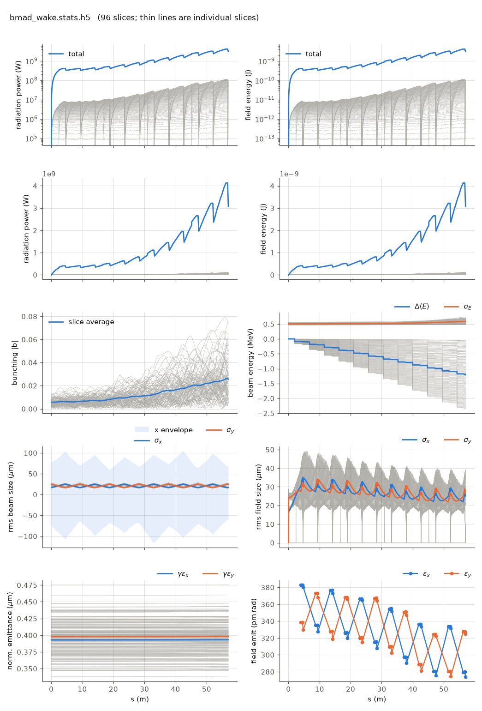

<!-- Generated by report_examples.py from examples/bmad_wake/. Do not edit. -->



Everything on this page lives in and runs from `lucifer/examples/bmad_wake/`.

Two commands, Bmad only:

    ../../../production/bin/lucifer lucifer.in
    ../../../production/bin/lucifer lucifer_transcribed.in
    python ../plot_fel.py bmad_wake.stats.h5

The chamber-wake physics of `../sase_wake`, delivered through Bmad's own wake
machinery instead of the transcribed Genesis 1.3 Version 4 (Genesis4) model.
`ztable.wake` is the Bane and Stupakov resistive-wall kernel for a 0.5 mm copper
chamber, attached as an `sr_wake` `z_long` table to every element of
`wake_lattice.bmad`. The undulators apply it once per element at mid-element across
the whole 96-slice window, and the quadrupoles and pipes apply it through Bmad's own
`track1_bunch`. The drift slots are pipes here, because a Bmad drift cannot carry a
wake.

The table was exported by `chamber_wake%write_kernels` and then converted to Bmad's
conventions: sign flipped to Bmad's positive-decelerating sense, the self-slice term
unhalved, the causal side at z < 0, and padding past the window. The recipe is in
`wake_lattice.bmad`'s header, and any `chamber_wake%on` configuration will
regenerate the kernel (the manual's [Bmad element wakes section](../../fel-physics.md)).

`lucifer_transcribed.in` is the comparison partner: the same beam and the same window
through the transcribed model with the same chamber, so the two runs differ in the
implementation and in nothing else. `../sase_wake` is not the partner, because it adds
the gap and roughness terms that this table has no counterpart for.

| implementation | exit mean energy change | granularity |
|---|---|---|
| transcribed `chamber_wake` | -2.319 m_e c^2 | per integration step |
| Bmad `sr_wake` `z_long` table | -2.335 m_e c^2 | once per element |

The two means differ by 0.69%. Per slice across the window interior the agreement is
0.80% on average and 1.73% at worst. One physical wake, two independent
implementations, two application granularities, and what separates them is the
granularity rather than the physics.

Runs in ~25 s.

## The input files

The deck, its variants, and any lattice they name, as they are on disk.

### `lucifer.in`

```fortran
&fel_params
  lat_file = "wake_lattice.bmad"
  global%out_root = "bmad_wake"
  global%ran_seed = 12345
/

&fel_beam_init
  beam_init%n_particle = 2048
  beam_init%bunch_charge = 2.881993782512e-13
  beam_init%distribution_type(3) = "GRID"
  beam_init%grid(3)%x_min = -1.44e-8
  beam_init%grid(3)%x_max =  1.44e-8
  beam_init%sig_pz = 8.804506566858e-5
  beam_init%a_norm_emit = 4e-7
  beam_init%b_norm_emit = 4e-7
  shot_noise = T
/

&fel_wavefront_init
  wavefront_init%lambda0 = 1e-10

  wavefront_init%seed_power = 0
  wavefront_init%grid_n_pts = 255
  wavefront_init%grid_half_width = 2e-4
  wavefront_init%window_length = 2.88e-8
  wavefront_init%window_sample = 3
/
```

### `lucifer_transcribed.in`

```fortran
&fel_params
  lat_file = "../aramis.bmad"
  global%out_root = "transcribed"

  chamber_wake%on = T
  chamber_wake%radius = 0.5e-3
  chamber_wake%material = "CU"
  global%ran_seed = 12345
/

&fel_beam_init
  beam_init%n_particle = 2048
  beam_init%bunch_charge = 2.881993782512e-13
  beam_init%distribution_type(3) = "GRID"
  beam_init%grid(3)%x_min = -1.44e-8
  beam_init%grid(3)%x_max =  1.44e-8
  beam_init%sig_pz = 8.804506566858e-5
  beam_init%a_norm_emit = 4e-7
  beam_init%b_norm_emit = 4e-7
  shot_noise = T
/

&fel_wavefront_init
  wavefront_init%lambda0 = 1e-10

  wavefront_init%seed_power = 0
  wavefront_init%grid_n_pts = 255
  wavefront_init%grid_half_width = 2e-4
  wavefront_init%window_length = 2.88e-8
  wavefront_init%window_sample = 3
/
```

### `wake_lattice.bmad`

```fortran
! The benchmark line with a resistive-wall chamber wake on every element, delivered
! through Bmad's own machinery. ztable.wake is the Bane and Stupakov kernel for a
! 0.5 mm copper chamber (AC conductivity 5.813e7 S/m, relaxation 8.1 um), exported by
! chamber_wake%write_kernels and then converted: sign flipped to Bmad's
! positive-decelerating convention, self-slice unhalved, causal side z < 0, padded past
! the window with zeros. Any chamber_wake%on run regenerates the exported kernel.
!
! The undulators apply it through the FEL walk, one whole-window kick at mid-element,
! and the quads and pipes through Bmad's own track1_bunch. The drift slots are pipes,
! tracked identically, because a Bmad drift cannot carry a wake.
call, file = ../aramis.bmad
UND[sr_wake] = {scale_with_length = T, z_long = {position_dependence = none, w = { call::ztable.wake }}}
QF[sr_wake]  = {scale_with_length = T, z_long = {position_dependence = none, w = { call::ztable.wake }}}
QD[sr_wake]  = {scale_with_length = T, z_long = {position_dependence = none, w = { call::ztable.wake }}}
P1: pipe, l = 0.44, sr_wake = {scale_with_length = T, z_long = {position_dependence = none, w = { call::ztable.wake }}}
P2: pipe, l = 0.24, sr_wake = {scale_with_length = T, z_long = {position_dependence = none, w = { call::ztable.wake }}}
FODOW: line = (UND, P1, QF, P2, UND, P1, QD, P2)
ARAMISW: line = (6*FODOW)
use, ARAMISW
```
