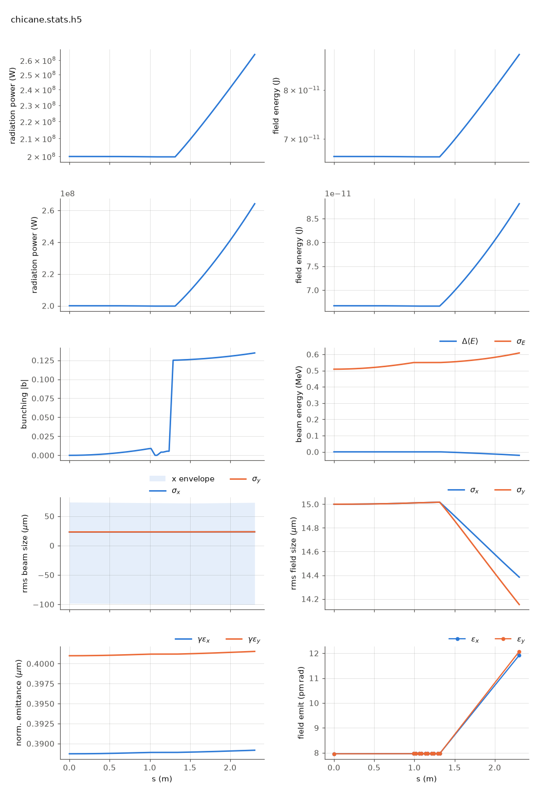

<!-- Generated by report_examples.py from examples/chicane/. Do not edit. -->

# A chicane between segments: phasing from real geometry



Two commands, Bmad only:

    ../../../production/bin/lucifer lucifer.in
    ../../../production/bin/lucifer lucifer_detuned.in

Two undulator segments with a four-bend closed-bump chicane in the break, in
absolute time tracking mode (`bmad_com[absolute_time_tracking] = T` in the
lattice): the inter-segment phase follows the real geometry. The beam detours the
bump while the radiation drifts the chord between the undulator faces (computed
from `ele%floor`, never entered by hand). The arc-minus-chord delay (583
wavelengths at the reference angle) re-injects the light onto the bunched beam
at whatever carrier phase the bend angle dictates.

The two lattices differ by 0.43 microradians of bend angle: half a wavelength of
delay. Measured (200 MW seed, two 0.99 m helical segments):

| lattice | P at segment-1 exit | P at line exit | segment-2 ratio |
|---|---|---|---|
| `chicane.bmad` (in phase) | 1.998e8 W | 2.642e8 W | 1.32 |
| `detuned.bmad` (+lambda/2 of delay) | 1.998e8 W | 1.872e8 W | 0.94 |

The second segment amplifies or absorbs on a half-wavelength of geometry -- the
re-phasing knob a real machine turns by trimming its chicane. In the default
relative mode the same two lattices produce identical output (the geometric
fraction is autophased away, the chicane semantics of Genesis 1.3 Version 4 (Genesis4)). The deliberate
off-phase knob there is the wiggler's own `z_offset` (manual: the phasing section).

Validated by the harness's phasing section: the re-anchor baseline flat, the
z_offset knob on the analytic slope, the knob curve equal to Genesis4's own
PHASESHIFTER scan at 6.0e-6, the absolute-mode chicane ramp on the independent
geometric prediction at 6.8e-4, the unaveraged ledger closing across the chicane
at 4.0e-6, and four refusals by name. Runs in ~1 s each.

## The input files

Every file below is read from `lucifer/examples/chicane/`, which is where the commands above are run.

### `lucifer.in`

```fortran
&fel_params
  lat_file = "chicane.bmad"
  global%out_root = "chicane"
  global%ran_seed = 12345
/

&fel_beam_init
  beam_init%n_particle = 8192
  beam_init%bunch_charge = 1.000692285594e-15
  beam_init%sig_z = 0
  beam_init%sig_pz = 8.804506566858e-5
  beam_init%a_norm_emit = 4e-7
  beam_init%b_norm_emit = 4e-7
/

&fel_wavefront_init
  wavefront_init%lambda0 = 1e-10

  wavefront_init%seed_power = 2e8
  wavefront_init%seed_waist_size = 30e-6
  wavefront_init%grid_n_pts = 151
  wavefront_init%grid_half_width = 2e-4
/
```

### `lucifer_detuned.in`

```fortran
&fel_params
  lat_file = "detuned.bmad"
  global%out_root = "detuned"
  global%ran_seed = 12345
/

&fel_beam_init
  beam_init%n_particle = 8192
  beam_init%bunch_charge = 1.000692285594e-15
  beam_init%sig_z = 0
  beam_init%sig_pz = 8.804506566858e-5
  beam_init%a_norm_emit = 4e-7
  beam_init%b_norm_emit = 4e-7
/

&fel_wavefront_init
  wavefront_init%lambda0 = 1e-10

  wavefront_init%seed_power = 2e8
  wavefront_init%seed_waist_size = 30e-6
  wavefront_init%grid_n_pts = 151
  wavefront_init%grid_half_width = 2e-4
/
```

### `chicane.bmad`

```fortran
ANG = 1e-3                     ! The reference bend angle.
call, file = chicane_base.bmad
```

### `chicane_base.bmad`

```fortran
! Chicane-between-segments example line (the manual's phasing section): two undulator segments
! with a four-bend closed-bump chicane in the break. Absolute time tracking is on, so
! the inter-segment phase follows the real geometry: the beam detours the bump while
! the radiation drifts the chord, and the arc-minus-chord delay -- thousands of
! wavelengths -- re-injects the light onto the bunched beam at whatever carrier phase
! the bend angle dictates. The wrappers define ANG before calling this file: two
! angles a half-wavelength of delay apart flip the second segment between absorbing
! and amplifying.

no_digested
parameter[geometry] = open
parameter[particle] = electron
parameter[e_tot] = 11357.82 * m_electron

beginning[beta_a] = 15
beginning[beta_b] = 15

bmad_com[absolute_time_tracking] = T

UND: wiggler, l = 0.99, l_period = 0.015, field_calc = helical_model, &
     b_max = 0.84853 * (twopi / 0.015) * m_electron / c_light, &
     tracking_method = custom, ds_step = 0.015

B1: sbend, l = 0.05, g =  ANG / 0.05
B2: sbend, l = 0.05, g = -ANG / 0.05
B3: sbend, l = 0.05, g = -ANG / 0.05
B4: sbend, l = 0.05, g =  ANG / 0.05
DD: pipe, l = 0.025

SEG: line = (UND, DD, B1, DD, B2, DD, B3, DD, B4, DD, UND)

use, SEG
```

### `detuned.bmad`

```fortran
ANG = 1e-3 + 4.29e-7           ! Half a wavelength more delay than chicane.bmad.
call, file = chicane_base.bmad
```
