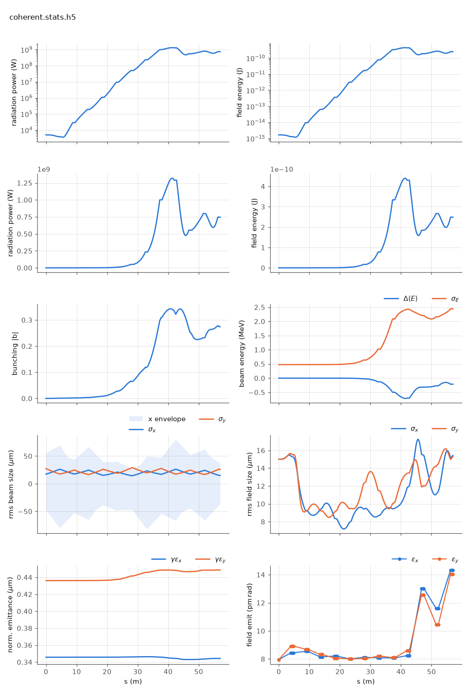

<!-- Generated by report_examples.py from examples/coherent_source/. Do not edit. -->



Everything on this page lives in and runs from `lucifer/examples/coherent_source/`.

Three commands, Bmad only:

    ../../../production/bin/lucifer lucifer.in
    ../../../production/bin/lucifer lucifer_low_m.in
    ../../../production/bin/lucifer lucifer_reference.in
    python ../plot_fel.py coherent.stats.h5

The use case (manual: the coherent-source section): runs whose beams are transversely
Gaussian (idealized machines, parameter scans, seeded amplifier studies) can
trade the per-particle source deposit for Tanaka's coherent retrieval
(`global%source_model = "coherent"`, PRAB 27, 030703 (2024)) and converge at one
to two orders of magnitude fewer macroparticles. The reason: with few particles
the per-cell source is spiky, and that sampling noise always overestimates the
gain. The coherent source carries the slice's exact bunching phasor on a fitted
Gaussian instead, so the artifact never enters.

Three runs of the same seeded steady-state case (the full Aramis line, 5.2
decades of gain, ../steady_state's configuration):

| run | source, particles/slice | exit power | vs reference | wall (12 threads) |
|---|---|---|---|---|
| `lucifer_reference.in` | deposit, 8192 | 7.62e+08 W | -- | 4.3 s |
| `lucifer_low_m.in` | deposit, 512 | 5.82e+09 W | 7.6x high (ln +2.03) | 2.0 s |
| `lucifer.in` | coherent, 512 | 7.46e+08 W | ln 0.021 | 2.2 s |

The middle row is the trap this feature exists to remove: cutting particles
without the coherent source silently multiplies the predicted power by 7.6 on
this case, with nothing anywhere reporting a problem. The last row is the same
particle count giving the converged answer. (Per-slice cost dominates real
time-dependent runs, where the same particle reduction pays proportionally.)

The guardrails are part of the feature (all refusals, the manual's coherent-source section). A per-slice Gaussianity test is sized against its own
sampling significance. A genuinely structured profile refuses. An offset,
mismatched or tilted Gaussian beam passes -- the source centers and tilts with
the beam's phasor-weighted moments. Harmonics, two polarizations and the
unaveraged mode are out of scope in v1. Dark starts are refused, at a measured
~175x startup deficit: SASE grows from spontaneous, spatially-incoherent
emission, which is exactly what the coherent model drops. Seed the field, as
here, or use the default deposit.

Plot any run with ../plot_fel.py <root>.stats.h5.

## The input files

The deck, its variants, and any lattice they name, as they are on disk.

### `lucifer.in`

```fortran
&fel_params
  lat_file = "../aramis.bmad"
  global%out_root = "coherent"
  global%source_model = "coherent"
/

&fel_beam_init
  beam_init%n_particle = 512
  beam_init%bunch_charge = 1.000692285594e-15
  beam_init%sig_z = 0
  beam_init%sig_pz = 8.804506566858e-5
  beam_init%a_norm_emit = 4e-7
  beam_init%b_norm_emit = 4e-7
/

&fel_wavefront_init
  wavefront_init%lambda0 = 1e-10

  wavefront_init%seed_power = 5e3
  wavefront_init%seed_waist_size = 30e-6
  wavefront_init%grid_n_pts = 255
  wavefront_init%grid_half_width = 2e-4
/
```

### `lucifer_low_m.in`

```fortran
&fel_params
  lat_file = "../aramis.bmad"
  global%out_root = "low_m"
/

&fel_beam_init
  beam_init%n_particle = 512
  beam_init%bunch_charge = 1.000692285594e-15
  beam_init%sig_z = 0
  beam_init%sig_pz = 8.804506566858e-5
  beam_init%a_norm_emit = 4e-7
  beam_init%b_norm_emit = 4e-7
/

&fel_wavefront_init
  wavefront_init%lambda0 = 1e-10

  wavefront_init%seed_power = 5e3
  wavefront_init%seed_waist_size = 30e-6
  wavefront_init%grid_n_pts = 255
  wavefront_init%grid_half_width = 2e-4
/
```

### `lucifer_reference.in`

```fortran
&fel_params
  lat_file = "../aramis.bmad"
  global%out_root = "reference"
/

&fel_beam_init
  beam_init%n_particle = 8192
  beam_init%bunch_charge = 1.000692285594e-15
  beam_init%sig_z = 0
  beam_init%sig_pz = 8.804506566858e-5
  beam_init%a_norm_emit = 4e-7
  beam_init%b_norm_emit = 4e-7
/

&fel_wavefront_init
  wavefront_init%lambda0 = 1e-10

  wavefront_init%seed_power = 5e3
  wavefront_init%seed_waist_size = 30e-6
  wavefront_init%grid_n_pts = 255
  wavefront_init%grid_half_width = 2e-4
/
```
