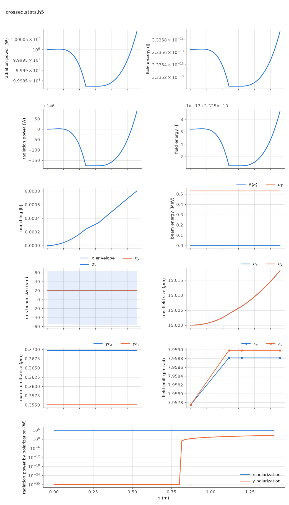

<!-- Generated by report_examples.py from examples/crossed_undulator/. Do not edit. -->



Everything on this page lives in and runs from `lucifer/examples/crossed_undulator/`.

An x-planar undulator (0.6 m) seeds and microbunches the beam. The same undulator
rotated a quarter turn (`UNDY: UNDX, tilt = pi/2` -- tilt is the polarization spec,
standard Bmad) follows after a short gap. Microbunching is longitudinal and
polarization-blind, so the y set radiates orthogonally polarized light seeded by the
bunching the x set built, while the x field passes through gaining nothing (the
harness holds that isolation at 1.6e-14, the manual's field-solver vector convention).

    ../../../production/bin/lucifer lucifer.in
    python ../plot_fel.py crossed.stats.h5

Measured by this example (1 MW x seed, 0.6 m x-set, 0.2 m gap, 0.6 m y-set):

| z (m) | P_x (W) | P_y (W) |
|---|---|---|
| 0.00 (entry) | 1.0000e6 | 0 |
| 0.60 (x-set exit) | 9.9982e5 | 0 |
| 1.00 (inside the y-set) | 9.9982e5 | 1.63e1 |
| 1.26 (exit) | 9.9982e5 | 1.35e2 |

P_x is flat through the y-set to five digits, while P_y climbs from nothing on the
microbunching the x-set left behind. The tilted undulator cannot amplify the
orthogonal component. It only diffracts it. `plot_fel.py` shows exactly this in its
polarization panel (the last one, present only when a run carries two components).
The figure is banked as `fel-benchmark-plots/crossed-afterburner.png`.

Outputs: `crossed-final-x.fld.h5` / `crossed-final-y.fld.h5` (one polarization per
file, in the format of Genesis 1.3 Version 4 (Genesis4)), and `crossed.stats.h5` with the field group carrying totals
plus the x component and a `field/y/` group. Runs in ~1 s.

## The input files

The deck, its variants, and any lattice they name, as they are on disk.

### `lucifer.in`

```fortran
&fel_params
  lat_file = "run_lattice.bmad"
  global%out_root = "crossed"
  global%ran_seed = 4242
/

&fel_beam_init
  beam_init%n_particle = 2048
  beam_init%bunch_charge = 1.000692285594e-15
  beam_init%sig_z = 0
  beam_init%sig_pz = 8.804506566858e-05
  beam_init%a_norm_emit = 4e-7
  beam_init%b_norm_emit = 4e-7
  beamlet_size = 8
/

&fel_wavefront_init
  wavefront_init%lambda0 = 1e-10
  wavefront_init%seed_power = 1e6
  wavefront_init%seed_waist_size = 30e-6
  wavefront_init%grid_n_pts = 129
  wavefront_init%grid_half_width = 2e-4
/
```

### `crossed.bmad`

```fortran
! Two-polarization probes (check_two_polarization.py). A symmetric configuration --
! round beam Twiss, no quads -- so the rotation-identity check (an all-y line must
! reproduce the all-x line under the x<->y swap) is not broken by the lattice.
!
! UNDX: planar, wiggles in x. UNDY: the same undulator physically rotated a quarter
! turn (tilt = pi/2), wiggling in y. Lines:
!   XLINE:   two x-planar segments                (the reference)
!   YLINE:   the same two segments, both tilted   (the rotation image)
!   CROSSED: x-segment then y-segment             (the crossed-undulator case)

no_digested
parameter[geometry] = open
parameter[particle] = electron
parameter[e_tot] = 11357.82 * m_electron

beginning[beta_a] = 12.0
beginning[alpha_a] = 0
beginning[beta_b] = 12.0
beginning[alpha_b] = 0

UNDX: wiggler, l = 0.60, l_period = 0.015, field_calc = planar_model, &
      b_max = 0.84853 * sqrt(2) * (twopi / 0.015) * m_electron / c_light, &
      tracking_method = fel_averaged, ds_step = 0.015

UNDY: UNDX, tilt = pi / 2

D1: pipe, l = 0.20

XLINE:   line = (UNDX, D1, UNDX)
YLINE:   line = (UNDY, D1, UNDY)
CROSSED: line = (UNDX, D1, UNDY)

use, XLINE
```

### `run_lattice.bmad`

```fortran
call, file = crossed.bmad
use, CROSSED
```
