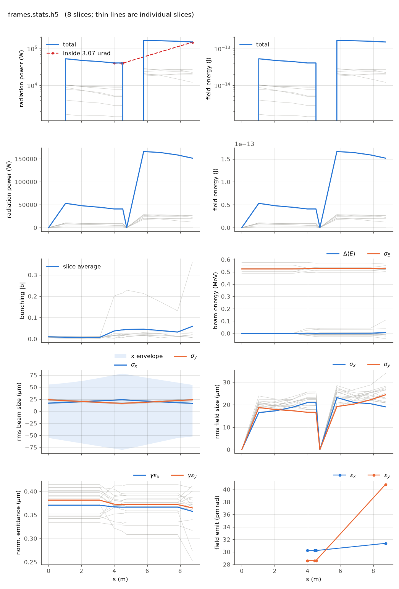

<!-- Generated by report_examples.py from examples/frames/. Do not edit. -->



Everything on this page lives in and runs from `lucifer/examples/frames/`.

One command:

    ../../../production/bin/lucifer lucifer.in

A run writes its beam and its field at element ends. A visualization wants them along z
inside the undulators, and it wants to follow a particle from one to the next. This deck
turns on the frame series and the field's reductions, and cuts both to four slices of the
window ([reading the output](../../reading-output.md)).

Two segments of the Aramis line, a 1 m comb and a 24 slice window at 3 wavelengths per
slice. Measured on this input:

| | value |
|---|---|
| records, and frames of each kind | 12 |
| slices in the window | 8 |
| slices a frame carries | 4, indices 3 to 6 |
| beam frame | 0.27 MB, 4 patches |
| field frame | 0.99 MB, 4 x 127 x 127 |
| statistics file with the reductions | 1.96 MB |
| everything the run wrote | 20 MB |
| exit power | 151.552 kW, pulse energy 151.657 fJ, `<|b|>` 0.0589 |
| walk | 0.4 s |

The frame index is the statistics record index, so `frames-000006.beam.h5`,
`frames-000006.wf.h5` and row 6 of `frames.stats.h5` are one position on the line. Frames
land inside the undulators and not only at their ends, which is the point of riding the
comb: at a 1 m comb on 8.74 m of line, six of the twelve fall strictly inside an
undulator, two on an undulator's end, three in the break between the two, and one at the
entry face.

Each file says where it was taken. `sPosition`, `elementName`, `phi0`, `sliceFirst` and
`sliceLast` are on every frame, an FEL frame adds `aw`, `ku`, `helical` and `tilt`, and
`floorPosition` and `floorAngles` place it in the lab. The averaged mode integrates the
quiver away, so a reader that wants the physical orbit rebuilds it from `aw`, `ku` and
`s`.

`global%migrate = T` is on so the labels have work to do. Every macroparticle carries one,
and it follows the particle when migration moves it to a neighbouring slice. Across this
series 4591 distinct labels appear in the four slices dumped, against 1024 in any one
frame: particles cross into and out of the range as they slip, and a label that stops
appearing has left it. That is what makes the series trajectories rather than snapshots.

`global%dump_reduced = T` writes the field's intensity projections into the statistics
file at every record, `xy_intensity`, `slice_x_intensity`, `slice_y_intensity` and the
complex field on axis. They integrate back to `power` exactly and are two hundred times
smaller than the field frames, so a picture of the run needs no field frame at all. The
frames are here for the views that want the transverse profile of one slice at one
position.

The range is what makes this affordable. The same deck over the whole window writes twice
the bytes, and a run at one wavelength per slice with thousands of slices would write
gigabytes a frame. [](../../performance.md) measures a full-size frame at 95 MB and
prices compression, which does not pay on this data.

Runs in ~0.4 s.

## The input files

The deck, its variants, and any lattice they name, as they are on disk.

### `lucifer.in`

```fortran
&fel_params
  lat_file = "../aramis.bmad"
  global%out_root = "frames"
  global%track_end = "UND##2"
  global%comb_ds_save = 1.0
  global%dump_at_comb = T
  global%dump_slice_first = 3
  global%dump_slice_last = 6
  global%dump_reduced = T
  global%migrate = T
  slicing%window_length = 2.4e-9
  slicing%n_wavelength = 3
/

&fel_beam_init
  beam_init%n_particle = 1024
  beam_init%bunch_charge = 2.401661485427e-14
  beam_init%distribution_type(3) = "GRID"
  beam_init%grid(3)%x_min = -1.2e-9
  beam_init%grid(3)%x_max =  1.2e-9
  beam_init%sig_pz = 8.804506566858e-5
  beam_init%a_norm_emit = 4e-7
  beam_init%b_norm_emit = 4e-7
  shot_noise = T
/

&fel_wavefront_init
  wavefront_init%lambda0 = 1e-10
  wavefront_init%seed_power = 0
  wavefront_init%grid_n_pts = 128
  wavefront_init%grid_half_width = 2e-4
/
```
