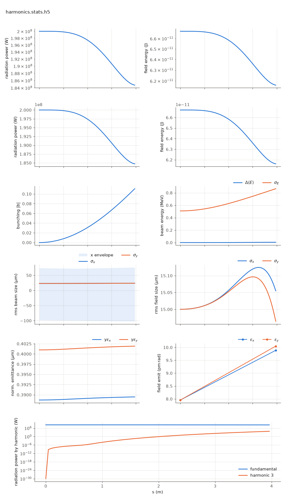

<!-- Generated by report_examples.py from examples/harmonics/. Do not edit. -->



Everything on this page lives in and runs from `lucifer/examples/harmonics/`.

One command, Bmad only:

    ../../../production/bin/lucifer lucifer.in
    python ../plot_fel.py harmonics.stats.h5

A strongly seeded steady-state run on a planar segment carrying two radiation
fields (namelist `harmonics = 1, 3`): the fundamental at 1 Angstrom and a third
harmonic at 1/3 Angstrom that starts dark and grows from the bunching the
fundamental drives -- nonlinear harmonic generation, at three times the
fundamental's growth rate (P3 rides |b3|^2, and b3 grows as b1^3).

Measured by this example (200 MW seed, 3.96 m planar, rms aw = 0.84853):

| z (m) | P1 (W) | P3 (W) |
|---|---|---|
| 0.00 | 2.000e8 | 0 |
| 1.98 | 1.975e8 | 7.3e-1 |
| 3.01 | 1.905e8 | 1.7e2 |
| 3.96 (exit) | 1.847e8 | 5.1e3 |

`plot_fel.py`'s harmonic panel shows both curves on one log scale, and that figure is
this example's page in the documentation. The harmonic's full wavefront_params
live under `field/harm3/` in the stats file. Its dump carries `-h3` in the name,
`harmonics-final-h3.wf.h5`, an openPMD EXT_Wavefront file with the photon energy
identifying the harmonic.

A helical undulator would give exactly nothing here: its coupling fc(h) vanishes
for every harmonic (manual: the harmonic-radiation section), which is why this example is planar.
Validated against Genesis 1.3 Version 4 (Genesis4) running the same configuration (fundamental 5.3e-8,
harmonic growth 1.3e-4) and against the exact Bessel deposit sum (3.3e-16) by the
harness's harmonic check section. Runs in ~1 s.

## The input files

The deck, its variants, and any lattice they name, as they are on disk.

### `lucifer.in`

```fortran
&fel_params
  lat_file = "harmonics.bmad"
  global%out_root = "harmonics"
  global%ran_seed = 12345
/

&fel_beam_init
  beam_init%n_particle = 8192
  beam_init%bunch_charge = 1.000692285594e-15
  beam_init%sig_z = 0
  beam_init%sig_pz = 8.804506566858e-5
  beam_init%a_norm_emit = 4e-7
  beam_init%b_norm_emit = 4e-7
/

&fel_wavefront_init
  wavefront_init%lambda0 = 1e-10
  wavefront_init%harmonics = 1, 3

  wavefront_init%seed_power = 2e8
  wavefront_init%seed_waist_size = 30e-6
  wavefront_init%grid_n_pts = 151
  wavefront_init%grid_half_width = 2e-4
/
```

### `harmonics.bmad`

```fortran
! Harmonic-lasing example lattice: one planar undulator segment at the benchmark
! energy and rms aw (planar, so the odd-harmonic couplings fc(h) are alive -- a
! helical device couples only the fundamental). Resonant at 1 Angstrom, and the
! third harmonic radiates at 1/3 Angstrom. Production defaults: the fel_averaged method
! on Bmad's own kernel maps, ds_step = 3 periods.

no_digested
parameter[geometry] = open
parameter[particle] = electron
parameter[e_tot] = 11357.82 * m_electron

beginning[beta_a] = 15
beginning[beta_b] = 15

UNDP: wiggler, l = 3.96, l_period = 0.015, field_calc = planar_model, &
      b_max = sqrt(2) * 0.84853 * (twopi / 0.015) * m_electron / c_light, &
      tracking_method = fel_averaged, ds_step = 0.045

SEGP: line = (UNDP)

use, SEGP
```
