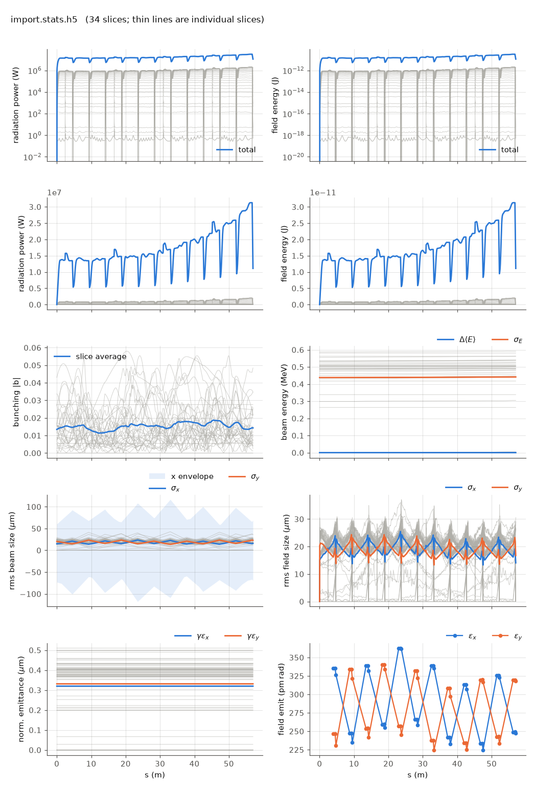

<!-- Generated by report_examples.py from examples/import/. Do not edit. -->



Everything on this page lives in and runs from `lucifer/examples/import/`.

Two commands, Bmad only:

    ../../../production/bin/lucifer lucifer.in
    ../../../production/bin/lucifer lucifer_from_file.in
    python ../plot_fel.py import.stats.h5

A bunch described by Bmad's `beam_init_struct`, which is the native equivalent of
what Genesis 1.3 Version 4 (Genesis4)'s `&beam` describes, generated by
`init_beam_distribution`, resampled into FEL slices by the transcribed Genesis4
`importdistribution` method, and tracked dark through the full line: SASE from an
imported bunch (the manual's [distribution-import section](../../fel-physics.md)).

The lattice is the whole optics specification. The reference energy comes from its
`e_tot`, and the bunch is generated matched to the Twiss in its `beginning`
statement, which is the FODO line's periodic solution. There is no `gamma0` knob and
no `match` transform, because both would be a second way of saying what the lattice
already says.

The bunch is a Gaussian test bunch sized to the FEL window's economics, and it is
labeled a test bunch for a reason: `sig_z = 1.2 nm` with 30 fC gives the benchmark
3 kA peak in a window a few hundred wavelengths long. A physical accelerator bunch
is micrometers and hundreds of pC, needs thousands of slices, and belongs to a
production run rather than to an example.

`resample%n_slice` is unset, so the time window is derived from the bunch itself by
Genesis4's `settimewindow` rule, and the per-slice current in the diag file is the
Gaussian profile the bunch actually has. `resample%slice_width = 0.01` is Genesis4's
`slicewidth`, the sampling window, and `resample%beamlet_size = 8` sets the beamlet
grouping the shot-noise loading uses.

The path runs in both directions, and the two decks here are the round trip.
`lucifer.in` generates the bunch and writes it with `write_openpmd_file` as
`import_bunch.h5`, 2.8 MB of openPMD. `lucifer_from_file.in` names that file in
`dist_file` instead of generating anything, and resamples it with the same settings.
`write_genesis_dist` is the third direction, handing the identical bunch to Genesis4's
`&importdistribution`.

Measured on this input: the exit power is 11.1 MW after 57 m, a startup from an
imported distribution rather than a saturated FEL. The round trip resolves to the same
34 slices, and the per-slice current profile comes back exactly, to the last bit, with
the per-slice mean energy agreeing to 2.3e-5.

What does not come back identical is the noise. Generating a bunch consumes random
numbers and reading one does not, so the two runs resample and load shot noise from
different points in the stream. The per-slice energy spread differs by 3% on average and
the exit power by 4%, which is a different SASE realization of the same physics rather
than a fidelity loss. `../sase` describes the same sensitivity: in a dark start, a small
change re-rolls the realization.

Runs in ~10 s each.

## The input files

The deck, its variants, and any lattice they name, as they are on disk.

### `lucifer.in`

```fortran
&fel_params
  lat_file = "../aramis.bmad"
  global%out_root = "import"
  global%ran_seed = 12345
/

&fel_beam_init
  resample%n_particle_per_slice = 2048
  resample%beamlet_size = 8

  use_beam_init = T
  write_openpmd_file = "import_bunch.h5"
  beam_init%n_particle = 50000
  beam_init%a_norm_emit = 4e-7
  beam_init%b_norm_emit = 4e-7
  beam_init%sig_z = 1.2e-9
  beam_init%sig_pz = 8.8045e-5
  beam_init%bunch_charge = 3.01e-14

  resample%slice_width = 0.01
/

&fel_wavefront_init
  wavefront_init%lambda0 = 1e-10

  wavefront_init%window_sample = 3

  wavefront_init%seed_power = 0
  wavefront_init%grid_n_pts = 255
  wavefront_init%grid_half_width = 2e-4
/
```

### `lucifer_from_file.in`

```fortran
&fel_params
  lat_file = "../aramis.bmad"
  global%out_root = "from_file"
  global%ran_seed = 12345
/

&fel_beam_init
  resample%n_particle_per_slice = 2048
  resample%beamlet_size = 8

  dist_file = "import_bunch.h5"

  resample%slice_width = 0.01
/

&fel_wavefront_init
  wavefront_init%lambda0 = 1e-10

  wavefront_init%window_sample = 3

  wavefront_init%seed_power = 0
  wavefront_init%grid_n_pts = 255
  wavefront_init%grid_half_width = 2e-4
/
```
