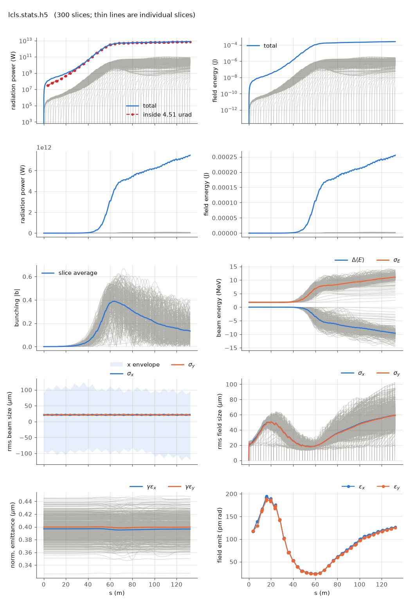

<!-- Generated by report_examples.py from examples/lcls/. Do not edit. -->



Everything on this page lives in and runs from `lucifer/examples/lcls/`.

One command, Bmad only:

    ../../../production/bin/lucifer lucifer.in
    python ../plot_fel.py lcls.stats.h5

LCLS at SLAC lased at 1.5 Angstrom in April 2009, the first hard X-ray free-electron laser, and reached saturation within its 132 m undulator. This example is that line at its published numbers: thirty-three planar segments, a coasting slab of the published beam, and SASE from the quiet start. It is the fourth machine the numerical settings are measured on, beside the 0.1 nm Aramis benchmark the other examples use and the 13.7 nm FLASH1 line of `../flash1` ([SASE convergence](../../startup-noise.md)).

The sources are P. Emma, *First lasing of the LCLS X-ray FEL at 1.5 Å*, PAC09, TH3PBI01, [proceedings](https://proceedings.jacow.org/pac2009/papers/th3pbi01.pdf), whose Tables 1, 2 and 4 carry the parameters, and Emma et al., *First lasing and operation of an ångstrom-wavelength free-electron laser*, Nature Photonics **4**, 641 (2010), [doi:10.1038/nphoton.2010.176](https://doi.org/10.1038/nphoton.2010.176).

## What is published and what this file chose

| quantity | published | source | this file | note |
|---|---|---|---|---|
| undulator period | 3.0 cm | Table 4 | 0.03 m | |
| peak field | 1.25 T | Table 4 | `b_max = 1.25` | |
| undulator parameter | K = 3.5 | Table 4 | K = 3.50148, aw = 2.475918 | derived from the field, 0.04 percent over |
| pole gap | 6.8 mm fixed | Table 4 | not modelled | a Bmad wiggler is described by its field |
| segments | 33, 3.4 m each | Table 4 | 33, 3.42 m | 114 whole periods, since 3.4 m is 113.3 of them |
| active length | 112 m | Table 4 | 112.86 m | |
| line length | 132 m | text | 132.20 m | |
| breaks | 47 cm, every third 90 cm | text | as published | |
| quadrupole | integrated gradient up to 3.0 T | Table 4 | 2.88 T over 0.20 m | the strength chosen, at 96 percent of the published maximum |
| beta function | 30 m mean | Table 4 | 30.1 m mean, 26.1 to 34.3 m | what the chosen strengths give |
| beam energy | 13.6 GeV | Table 1 | 13.6 GeV | resonance 1.5099 Angstrom against 1.5 |
| bunch charge | 0.25 nC | Table 1 | not stated, the window is flat | |
| peak current | 3.0 kA measured, 3.4 design | Table 1 | 3.0 kA | |
| slice emittance | 0.3 to 0.4 mm mrad at the injector | Table 1 | 0.4 µm both planes | the upper end |
| projected emittance at 14 GeV | 0.5 to 1.6 mm mrad | Table 1 | | the slice value is what the FEL sees |
| slice energy spread | 20 keV at 135 MeV, compression 90 | Tables 1, 2 | `sig_pz = 1.3e-4` | argued below |

Two numbers are this file's and are marked in the lattice header. The segment is a whole number of periods because the FEL step wants one. The quadrupole strengths are chosen so the mean beta function is the published 30 m, since the paper gives the maximum integrated gradient and not the operating one. That the chosen strengths land at 96 percent of that maximum is a check on the design rather than an input: the machine runs its quadrupoles nearly hard to hold 30 m over a 132 m line.

The field and K agree here to 0.04 percent, where the FLASH1 line's two published numbers are 2.7 percent apart. The resonance that follows at 13.6 GeV is 1.5099 Angstrom against the published 1.5.

The slice energy spread. The papers give no value at the undulator, and two numbers that fix one. The laser heater is set to a nominal 20 keV rms at 135 MeV (Table 2), and the total compression factor is 90 (Table 1), so the slice spread arriving at the undulator is 1.8 MeV, which is 1.3e-4 of 13.6 GeV. That is 0.23 of the Pierce parameter this beam gives, 5.85e-4, which is where a laser heater is meant to leave it. The published emittance range is wider than the gain it buys: at 1024 macroparticles per slice, 0.3 µm gives a power gain length of 3.52 m and saturation at 55 m where 0.4 µm gives 3.93 m and 62 m.

## What the run measures

Four seeds at the settings below. The spread is the SASE fluctuation of a 300-slice window.

| quantity | this deck | published | source |
|---|---|---|---|
| power gain length in the exponential regime | 3.81 +- 0.04 m | 3.3 m measured, 4.5 m design | Table 1 |
| saturation, where the bunching peaks | 64.7 +- 1.9 m | about 60 m | text |
| peak bunching factor | 0.384 +- 0.037 | | |
| peak power in one slice | 14.1 +- 1.0 GW | 15 GW | text |
| pulse energy at the published 75 fs duration | 1.06 mJ | 1.1 mJ | text |
| mean energy loss per electron at the exit | 10.06 +- 0.25 MeV | 4.6 MeV over the whole bunch | text |

The peak power per slice is the direct comparison, since it does not depend on how much of the real bunch carries 3 kA, and it lands within 6 percent of the machine. Multiplied by the published 75 fs pulse duration it gives the pulse energy to within 4 percent. The gain length sits between the measured 3.3 m and the design 4.5 m, and the saturation point within 8 percent of the machine.

The energy loss is the one number that does not compare directly. This window carries 3 kA everywhere and lases everywhere, while the real bunch has a current spike, so the whole 0.25 nC does not radiate at this rate. The paper's 4.6 MeV is the loss spread over the whole charge, and it was measured with 25 of the 33 segments installed. At 100 m, which is those 25 segments, this run has lost 8.19 MeV, so about half of the real bunch's charge radiates at the rate of this window.

## The window, and why it is a slab

At 1.5 Angstrom the published 0.25 nC bunch is 10 µm long, which is 66000 wavelengths and 500 cooperation lengths, and the whole line slips the light forward by 3762 wavelengths, 0.57 µm. A time-dependent run over the whole bunch would need tens of thousands of slices and would learn nothing the interior of a shorter window does not say, since each cooperation length lases independently of the others. The deck therefore carries a flat 3 kA slab of 300 slices at 68 wavelengths, 3.08 µm, which is 150 cooperation lengths long and 5.4 times the slippage. The pulse energy above is the peak power per slice times the machine's own pulse duration, not a sum over this window.

## The numerical settings, and how each was chosen

Every value is measured on this machine.

| setting | here | measured |
|---|---|---|
| `grid_n_pts`, `grid_half_width` | derived: 127 points over 191.4 µm | the deck states neither. Cells of 3.038 µm are the beam size over 7, the criterion of the convergence page, and both are printed with their origin at setup |
| `slicing%n_wavelength` | 68 | two slices per cooperation length. Thirty-four wavelengths per slice over 600 slices, the same window at twice the sampling, gives a gain length of 3.76 m against 3.79 and saturation at 62.7 m against 63.3, at twice the wall clock |
| `slicing%n_slice` | 300 | 3.08 µm, 5.4 times the whole line's slippage |
| `ds_step` (lattice) | 0.09 m | three periods, 38 steps per segment. One period gives the same gain length to two decimals and 4 percent more exit power, inside the seed spread, at 2.3 times the wall clock |
| `beam_init%n_particle` | 4096 | 1024 leaves 21 percent of the exit power outside the mode, 4096 leaves 5.4 percent. The convergence page asks for under 10 |
| `beamlet_size` | 8, the default | |
| `global%source_filter` | F, the default | on at its derived 4.5 µrad edge it removes 105 times the wide-angle power and moves the mode power 4 percent, since 4096 macroparticles has already converged |

The run's own convergence report puts the power outside the split angle of 4.5 µrad at 0.057 times the power inside it, so 5 percent of the total field power is the wide-angle emission of the point beamlets and the rest is the mode.

The lattice carries the optics, so the beam is generated matched to the periodic solution in the `beginning` statement, which the run holds between 26.1 and 34.3 m over the line. There is no `gamma0` and no match transform.

Runs in ~90 s, the longest of the examples that do not need Genesis4. A hard X-ray line is 132 m of undulator at 1254 integration steps, and the slices are what they are.

## The input files

The deck, its variants, and any lattice they name, as they are on disk.

### `lucifer.in`

```fortran
&fel_params
  lat_file = "lcls.bmad"
  global%out_root = "lcls"
  slicing%n_slice = 300
  slicing%n_wavelength = 68
/

&fel_beam_init
  beam_init%n_particle = 4096
  beam_init%bunch_charge = 3.082369e-11
  beam_init%distribution_type(3) = "GRID"
  beam_init%grid(3)%x_min = -1.540118e-6
  beam_init%grid(3)%x_max =  1.540118e-6
  beam_init%sig_pz = 1.3e-4
  beam_init%a_norm_emit = 4e-7
  beam_init%b_norm_emit = 4e-7
  shot_noise = T
/

&fel_wavefront_init
  wavefront_init%lambda0 = 1.50992e-10

  wavefront_init%seed_power = 0
/
```

### `lcls.bmad`

```fortran
! LCLS at SLAC, the undulator line that lased at 1.5 Angstrom in April 2009, from the
! published numbers.
!
! Undulator and optics, from P. Emma, "First lasing of the LCLS X-ray FEL at 1.5 A",
! PAC09, TH3PBI01, Table 4: thirty-three planar segments of 3.4 m at a 3.0 cm period,
! peak field 1.25 T, undulator parameter K = 3.5, a fixed 6.8 mm pole gap, and a mean
! beta function of 30 m. Its text gives the break structure: 47 cm between segments with
! every third break 90 cm, one quadrupole in each, of integrated gradient up to 3.0 T,
! for 132 m of line holding 112 m of undulator. Emma et al., Nature Photonics 4, 641
! (2010) is the same machine.
!
! Two numbers here are this file's and not the paper's.
!
! The segment is 114 periods, 3.42 m, since 3.4 m is 113.3 of them and the FEL step wants
! a whole number. The line is then 112.86 m of undulator inside 132.20 m, against the
! paper's 112 and 132.
!
! The quadrupole strengths are chosen so the mean beta function is the paper's 30 m,
! which it holds to between 26.1 and 34.2 m over the six-segment supercell. The paper
! gives the maximum integrated gradient and not the operating one. What these strengths
! ask for is 2.88 T over a 0.20 m quadrupole, 96 percent of that maximum, so the machine
! runs its quadrupoles nearly hard to hold 30 m. A planar undulator focuses vertically
! only, and its own focusing here gives beta_y = 51.3 m, which is why the two strengths
! are not equal and opposite.
!
! b_max = 1.25 T at l_period = 0.03 gives K = 3.50148 by eq. awmap of the physics manual,
! against the paper's 3.5, and aw = K/sqrt(2) = 2.475918. The resonance at 13.6 GeV is
! then 1.5099 Angstrom against the paper's 1.5. Both agree far better than the 2.7
! percent the FLASH1 line carries, since here the field and K are consistent.

no_digested
parameter[geometry] = open
parameter[particle] = electron
parameter[e_tot] = 13.6e9

! The matched periodic Twiss of the supercell below, at the entrance of a segment.
beginning[beta_a]  = 26.830
beginning[alpha_a] = -0.84237
beginning[beta_b]  = 33.341
beginning[alpha_b] = 1.03711

! ds_step = 3 periods, 38 steps per segment, the step this line's checks were run at.
UND: wiggler, l = 3.42, l_period = 0.03, field_calc = planar_model, &
     b_max = 1.25, tracking_method = fel_averaged, ds_step = 0.09

DS: drift, l = 0.135      ! Either side of a quadrupole in a 47 cm break.
DL: drift, l = 0.350      ! Either side of a quadrupole in a 90 cm break.
QF: quadrupole, l = 0.20, k1 =  0.3178
QD: quadrupole, l = 0.20, k1 = -0.3113

BSF: line = (DS, QF, DS)
BSD: line = (DS, QD, DS)
BLF: line = (DL, QF, DL)
BLD: line = (DL, QD, DL)

! Six segments, breaks 47, 47, 90, 47, 47, 90, quadrupoles alternating. The break
! pattern has period three and the quadrupole polarity period two, so six is the cell.
CELL: line = (UND, BSF, UND, BSD, UND, BLF, UND, BSD, UND, BSF, UND, BLD)

! Thirty-three segments: five whole cells and three more, so the last two breaks are
! short and carry a focusing and a defocusing quadrupole as the pattern asks.
LCLS: line = (5*CELL, UND, BSF, UND, BSD, UND)

use, LCLS
```
