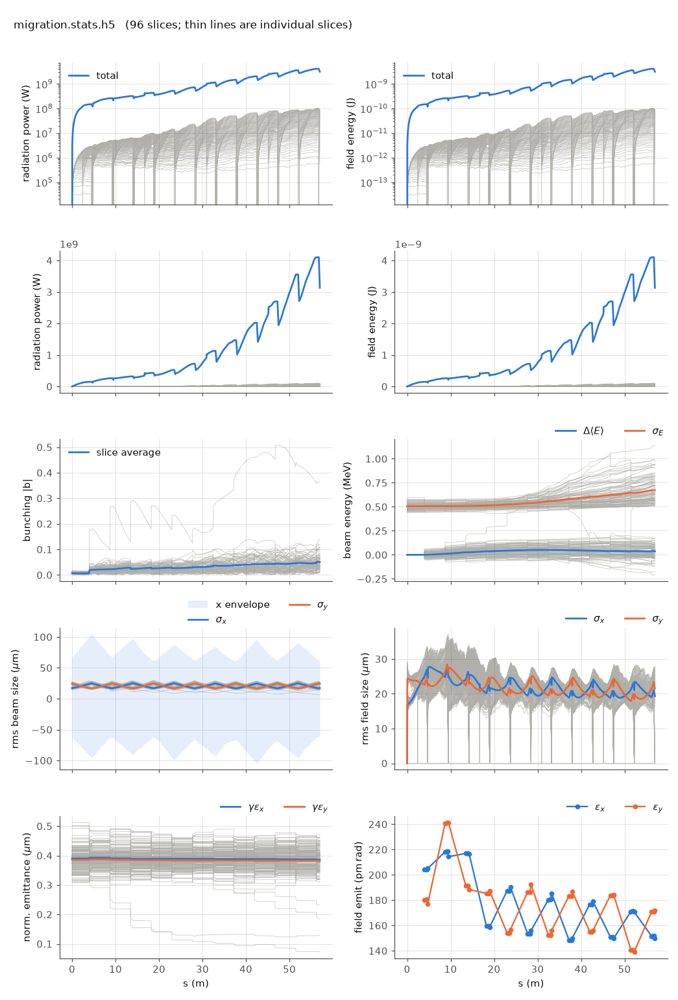

<!-- Generated by report_examples.py from examples/migration/. Do not edit. -->



Everything on this page lives in and runs from `lucifer/examples/migration/`.

Two commands, Bmad only:

    ../../../production/bin/lucifer lucifer.in
    ../../../production/bin/lucifer lucifer_no_migrate.in
    python ../plot_fel.py migration.stats.h5

A particle's ponderomotive phase drifts, and once it leaves the slice window the
particle belongs to a neighboring slice. `global%migrate = T` moves it there. This
run is the `../sase` configuration at 1024 particles per slice with migration on, and
`lucifer_no_migrate.in` is the same run with it off.

No artificial driver is needed to make this happen. The phase advance a particle
accumulates depends on its energy and on its betatron angles, both of which vary
across the beam, so a real beam in a real line migrates on its own. Adding
`../sase_wake`'s chamber block to this deck raises the moves from 148,777 to 226,776
and the dropped charge from 1.47% to 3.05%, because a wake that costs the tail slices
121 keV/m and the head slices 1.9 keV/m is a systematic phase walk on top of the beam's
own spread.

Measured on this input:

| | value |
|---|---|
| particles moved between slices | 148,777 over 48 element ends |
| charge dropped off the window ends | 4.23e-15 C, 1.47% of the 2.88e-13 C beam |
| worst bunching deviation | 7.61e-16 |
| exit power, `migrate = T` | 3.13 GW, exit bunching 0.051 |
| exit power, `migrate = F` | 1.81 GW, exit bunching 0.035 |

The exit powers are at this deck's grid and particle count, and a dark start's power
depends on both ([startup noise](../../startup-noise.md)). The ratio between the
two rows is the measurement here.

`migration.migration.txt` carries one row per event with the s position, the count,
the charge dropped and the phasor deviation, and the totals at the end. The rows are
what a plot of migration would be drawn from.

The sharpest way to see the difference is the per-slice current. With `migrate = F` it
cannot change: all 96 slices sit at exactly 3000 A at the exit, the value they were
loaded with, because no particle ever leaves the slice it started in. With `migrate = T`
the profile evolves to between 237 and 3442 A, and the drain is at the high-index end of
the window, where slices 95 and 94 fall to 237 A and 1591 A. In the plot, that emptied
slice is the one gray line whose bunching climbs to 0.36 while every other slice stays
near 0.05. That is a small-population artifact rather than physics: a slice with a
fifteenth of its charge left has a noisy bunching estimate, and `n_eff` in the diag
columns is what says so.

The last two table rows are the reason this is not a bookkeeping detail. With migration
off, a particle whose phase has left its slice keeps radiating into the field of the
slice it started in, and the bunching each slice sees is smeared by contributions that
belong elsewhere. On this configuration that costs a factor of 1.73 in exit power. The
default is off because Genesis 1.3 Version 4 (Genesis4) does not migrate without
one4one, so the comparison tiers would be measuring a model difference rather than a
transcription ([validation](../../validation.md), the slice-migration section).

`migrate_check = T` is the instrument rather than the feature. It verifies that the
whole-beam weighted phasor obeys `S_before = S_after + S_dropped` across every move,
and the 7.61e-16 above is that residual. Migration under weights is this port's
generalization of a Genesis4 method that requires one4one, and the check is what earns
the generalization.

Runs in ~15 s each.

## The input files

The deck, its variants, and any lattice they name, as they are on disk.

### `lucifer.in`

```fortran
&fel_params
  lat_file = "../aramis.bmad"
  global%out_root = "migration"
  global%migrate = T
  global%migrate_check = T
/

&fel_beam_init
  beam_init%n_particle = 1024
  beam_init%bunch_charge = 2.881993782512e-13
  beam_init%distribution_type(3) = "GRID"
  beam_init%grid(3)%x_min = -1.44e-8
  beam_init%grid(3)%x_max =  1.44e-8
  beam_init%sig_pz = 8.804506566858e-5
  beam_init%a_norm_emit = 4e-7
  beam_init%b_norm_emit = 4e-7
  shot_noise = T
/

&fel_wavefront_init
  wavefront_init%lambda0 = 1e-10
  wavefront_init%seed_power = 0
  wavefront_init%grid_n_pts = 151
  wavefront_init%grid_half_width = 2e-4
  wavefront_init%window_length = 2.88e-8
  wavefront_init%window_sample = 3
/
```

### `lucifer_no_migrate.in`

```fortran
&fel_params
  lat_file = "../aramis.bmad"
  global%out_root = "no_migrate"
/

&fel_beam_init
  beam_init%n_particle = 1024
  beam_init%bunch_charge = 2.881993782512e-13
  beam_init%distribution_type(3) = "GRID"
  beam_init%grid(3)%x_min = -1.44e-8
  beam_init%grid(3)%x_max =  1.44e-8
  beam_init%sig_pz = 8.804506566858e-5
  beam_init%a_norm_emit = 4e-7
  beam_init%b_norm_emit = 4e-7
  shot_noise = T
/

&fel_wavefront_init
  wavefront_init%lambda0 = 1e-10
  wavefront_init%seed_power = 0
  wavefront_init%grid_n_pts = 151
  wavefront_init%grid_half_width = 2e-4
  wavefront_init%window_length = 2.88e-8
  wavefront_init%window_sample = 3
/
```
