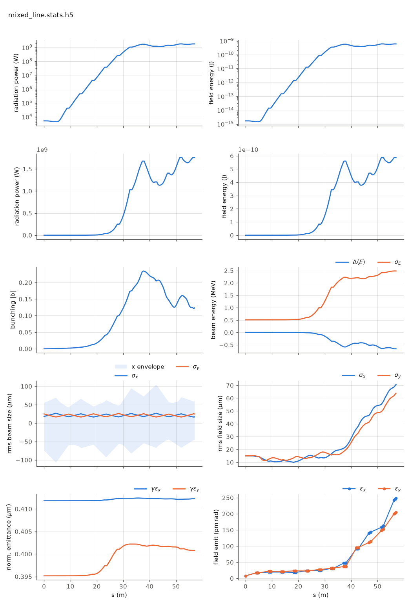

<!-- Generated by report_examples.py from examples/mixed_line/. Do not edit. -->



Everything on this page lives in and runs from `lucifer/examples/mixed_line/`.

Two commands, Bmad only:

    ../../../production/bin/lucifer lucifer.in
    ../../../production/bin/lucifer lucifer_averaged.in
    python ../plot_fel.py mixed_line.stats.h5

The tracking method is an element attribute, so a line whose segments are tracked
differently is a line of elements that differ. `mixed.bmad` calls `../aramis.bmad`
for its parameters, defines `UNDU` as the same undulator carrying
`fel_tracking = fel_unaveraged`, and puts one `UNDU` in the third FODO cell. Eleven
segments run the averaged default and the fifth runs unaveraged, integrating the real
helical field with no period averaging (the manual's [unaveraged-mode section](../../fel-physics.md)).

`lucifer_averaged.in` is the all-averaged twin, which overrides that one element back
to the default. The two runs differ in one segment's method and in nothing else.

Measured on this input (seeded steady state, 129-point grid):

| | value |
|---|---|
| first difference between the runs | z = 19.045 m, the first record inside `UNDU` |
| largest difference along the line | 2.68e-2 in ln P, at z = 24.7 m |
| difference at the exit | -7.39e-3 in ln P (1.757 GW against 1.770 GW) |

In the plot the log-power panel runs straight through the boundary at 19 to 23 m, with
no step and no kink where the method changes, and saturation arrives at 37 m as it does
on the all-averaged line. A 2.7% difference is not visible on a six-decade axis, which
is why the table above is the actual check and the plot is the sanity check.

The two curves are bit-identical up to the method boundary, which is the check that
the mixing itself is what differs. Through the unaveraged segment they separate by
2.7%, and by the exit they have converged back to 0.74%: two formulations of the same
physics, sharing no approximation, handing the same beam and field back and forth
across an element boundary.

The cost is where the difference is spent. The one unaveraged segment takes about 5 s
of the 6 s run at 20 substeps per period, and the eleven averaged segments share the
rest. That is what per-element selection buys: the expensive method in the segment
where it is wanted, the cheap one everywhere else.

Collective effects are refused in a line with any unaveraged segment, so this example
carries none, and the refusal itself is checked by the harness.

The harness runs the same configuration as its sandwich check, where the mixed line must
agree with the all-averaged line at the exit, the energy ledger rows must appear only
inside the unaveraged segment, and a wake on that segment must be refused by name
([validation](../../validation.md)). This directory is the runnable version of that
check.

Runs in ~7 s, and the averaged twin in ~1 s.

## The input files

The deck, its variants, and any lattice they name, as they are on disk.

### `lucifer.in`

```fortran
&fel_params
  lat_file = "mixed.bmad"
  global%out_root = "mixed_line"
/

&fel_beam_init
  beam_init%n_particle = 2048
  beam_init%bunch_charge = 1.000692285594e-15
  beam_init%sig_z = 0
  beam_init%sig_pz = 8.804506566858e-5
  beam_init%a_norm_emit = 4e-7
  beam_init%b_norm_emit = 4e-7
/

&fel_wavefront_init
  wavefront_init%lambda0 = 1e-10
  wavefront_init%seed_power = 5e3
  wavefront_init%seed_waist_size = 30e-6
  wavefront_init%grid_n_pts = 129
  wavefront_init%grid_half_width = 2e-4
/
```

### `lucifer_averaged.in`

```fortran
&fel_params
  lat_file = "mixed_averaged.bmad"
  global%out_root = "mixed_averaged"
/

&fel_beam_init
  beam_init%n_particle = 2048
  beam_init%bunch_charge = 1.000692285594e-15
  beam_init%sig_z = 0
  beam_init%sig_pz = 8.804506566858e-5
  beam_init%a_norm_emit = 4e-7
  beam_init%b_norm_emit = 4e-7
/

&fel_wavefront_init
  wavefront_init%lambda0 = 1e-10
  wavefront_init%seed_power = 5e3
  wavefront_init%seed_waist_size = 30e-6
  wavefront_init%grid_n_pts = 129
  wavefront_init%grid_half_width = 2e-4
/
```

### `mixed.bmad`

```fortran
! The benchmark line with one segment tracked unaveraged and the other eleven averaged.
! The tracking method is an element attribute, so a mixed line is a line of elements
! that differ, exactly as the tapered line is (fel-physics.md sec-element).

call, file = ../aramis.bmad

fel_unaveraged = 1   ! Named value for fel_tracking (doc/input-reference.md).

UNDU: UND, fel_tracking = fel_unaveraged

CELL:  line = (UND,  D1, QF, D2, UND, D1, QD, D2)
CELLU: line = (UNDU, D1, QF, D2, UND, D1, QD, D2)
MIXED: line = (2*CELL, CELLU, 3*CELL)

use, MIXED
```

### `mixed_averaged.bmad`

```fortran
! The all-averaged twin of mixed.bmad: the one unaveraged segment overridden back to
! the default, so the two runs differ in that segment's method and nothing else.

call, file = mixed.bmad

fel_averaged = 0

UNDU[FEL_TRACKING] = fel_averaged
```
