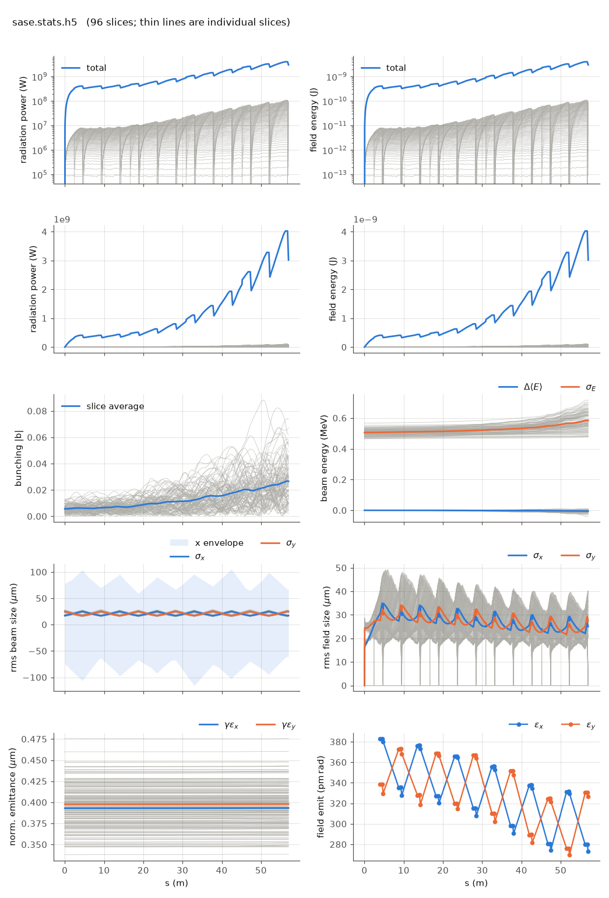

<!-- Generated by report_examples.py from examples/sase/. Do not edit. -->



Everything on this page lives in and runs from `lucifer/examples/sase/`.

One command, Bmad only:

    ../../../production/bin/lucifer lucifer.in
    python ../plot_fel.py sase.stats.h5

Self-amplified spontaneous emission from nothing but the electrons. The loader
generates a 96-slice time window at a spacing of 3 wavelengths, imposes physical
shot noise by weighted Fawley loading, starts the field dark (`seed_power = 0`),
and the FEL grows through the full line with slippage active. Before imposing the
noise the loader prints the per-slice electron count `N_lambda`, the effective
count `N_eff`, and the quiet floor it verified, so the noise level is a reported
number rather than an assumption.

The beam is a flat coasting bunch said in Bmad's own vocabulary:
`distribution_type(3) = "GRID"` over the window extent, with the current derived as
`I = Q*c/extent`, so `bunch_charge` encodes 3 kA exactly.

Measured on this input (`ran_seed` at its 12345 default): startup power settles near
4 MW per slice after the first segment, the total reaches 3.0 GW at z = 57 m with a
per-slice spread of 0.91, which is the SASE fluctuation, and the induced energy
spread grows from 0.99 to 1.14 m_e c^2. These powers are at this deck's grid and
particle count, and a dark start's power depends on both
([startup noise](../../startup-noise.md)).

Two features of the plot are physics rather than artifacts. The total-power sawtooth
is radiation slipping out of the head of a finite time window at each drift while
fresh vacuum enters at the tail, identical in Genesis 1.3 Version 4 (Genesis4) and in
any finite window. Deep saturation of every slice needs a window longer than the
total slippage. The per-slice spaghetti in the power panel is the slippage cascade
itself.

`global%keep_escaped_field = T` banks what slips out and reconstructs the whole
pulse at the exit. It is off here because on this configuration the bank and the
reconstructed pulse come to 1.2 GB and 1.3 GB, and because those two files are the
one place the tracker still writes Genesis4 field conventions rather than openPMD
([reading an output file](../../reading-output.md)).

Runs in ~25 s.

## The input files

The deck, its variants, and any lattice they name, as they are on disk.

### `lucifer.in`

```fortran
&fel_params
  lat_file = "../aramis.bmad"
  global%out_root = "sase"
/

&fel_beam_init
  beam_init%n_particle = 2048
  beam_init%bunch_charge = 2.881993782512e-13
  beam_init%distribution_type(3) = "GRID"
  beam_init%grid(3)%x_min = -1.44e-8
  beam_init%grid(3)%x_max =  1.44e-8
  beam_init%sig_pz = 8.804506566858e-5
  beam_init%a_norm_emit = 4e-7
  beam_init%b_norm_emit = 4e-7
  shot_noise = T
/

&fel_wavefront_init
  wavefront_init%lambda0 = 1e-10

  wavefront_init%seed_power = 0
  wavefront_init%grid_n_pts = 255
  wavefront_init%grid_half_width = 2e-4

  wavefront_init%window_length = 2.88e-8
  wavefront_init%window_sample = 3
/
```
