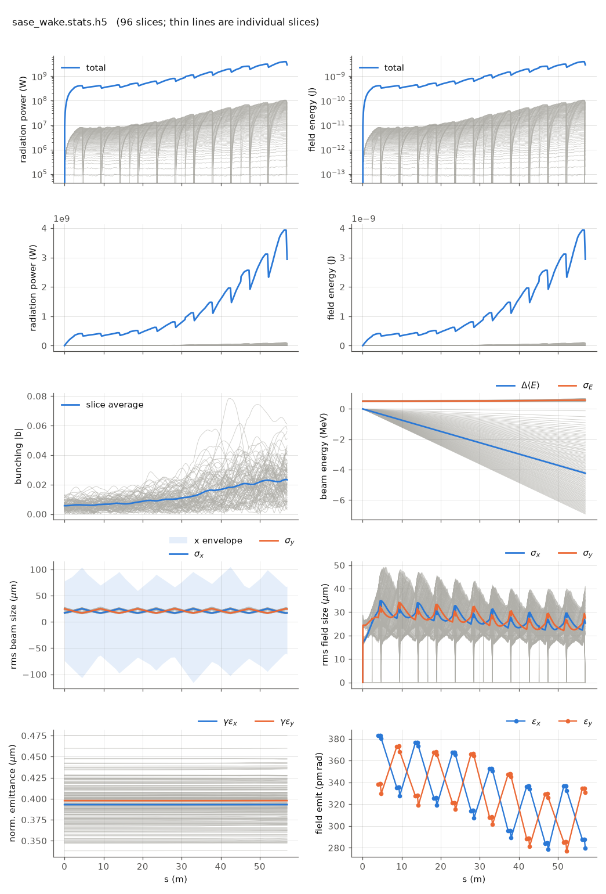

<!-- Generated by report_examples.py from examples/sase_wake/. Do not edit. -->



Everything on this page lives in and runs from `lucifer/examples/sase_wake/`.

One command, Bmad only:

    ../../../production/bin/lucifer lucifer.in
    python ../plot_fel.py sase_wake.stats.h5

The `../sase` run through a deliberately narrow copper chamber of 0.5 mm radius,
plus the undulator gap wake and a 100 nm rough surface. All three wake families are
transcribed from Genesis 1.3 Version 4 (Genesis4) and act as a per-slice energy-loss
rate: the resistive wall through the numerical impedance of Bane and Stupakov, the
gap wake convolved with dI/ds, and roughness through the complex-q contour
(the manual's [wakes section](../../fel-physics.md)).

The chamber is a tuned demonstration case, labeled as one. At 5.8 GeV and
1 Angstrom a normal chamber's wake is small, and this radius exists to make the
physics visible in one run.

Measured on this input: the run writes the per-slice energy-loss rate to
`sase_wake.wake.txt` at 1.94 to 121.5 keV/m across the window, the head slices losing
least because the wake is causal and the head has little charge ahead of it. The mean
energy drops 8.29 m_e c^2, about 4.24 MeV, over the 57 m line, and the per-slice drop
runs from 0.25 to 13.56 m_e c^2 across the window. That is clearly visible in the
energy panel against the 1 m_e c^2 initial spread. The SASE still reaches 2.94 GW,
against 3.02 GW for the same run with no wake. Both powers are at this deck's grid and
particle count, and a dark start's power depends on both
([startup noise](../../startup-noise.md)).

The same resistive-wall kernel applied through Bmad's own wake machinery instead of
the transcribed model is `../bmad_wake`, which carries both runs and their agreement.
What a loss this size does to the ponderomotive phases is `../migration`.

Runs in ~25 s.

## The input files

The deck, its variants, and any lattice they name, as they are on disk.

### `lucifer.in`

```fortran
&fel_params
  lat_file = "../aramis.bmad"
  global%out_root = "sase_wake"

  chamber_wake%on = T
  chamber_wake%radius = 0.5e-3
  chamber_wake%material = "CU"
  chamber_wake%gap = 0.5e-3
  chamber_wake%lgap = 0.015
  chamber_wake%hrough = 100e-9
  chamber_wake%lrough = 100e-6
/

&fel_beam_init
  beam_init%n_particle = 2048
  beam_init%bunch_charge = 2.881993782512e-13
  beam_init%distribution_type(3) = "GRID"
  beam_init%grid(3)%x_min = -1.44e-8
  beam_init%grid(3)%x_max =  1.44e-8
  beam_init%sig_pz = 8.804506566858e-5
  beam_init%a_norm_emit = 4e-7
  beam_init%b_norm_emit = 4e-7
  shot_noise = T
/

&fel_wavefront_init
  wavefront_init%lambda0 = 1e-10

  wavefront_init%seed_power = 0
  wavefront_init%grid_n_pts = 255
  wavefront_init%grid_half_width = 2e-4

  wavefront_init%window_length = 2.88e-8
  wavefront_init%window_sample = 3
/
```
