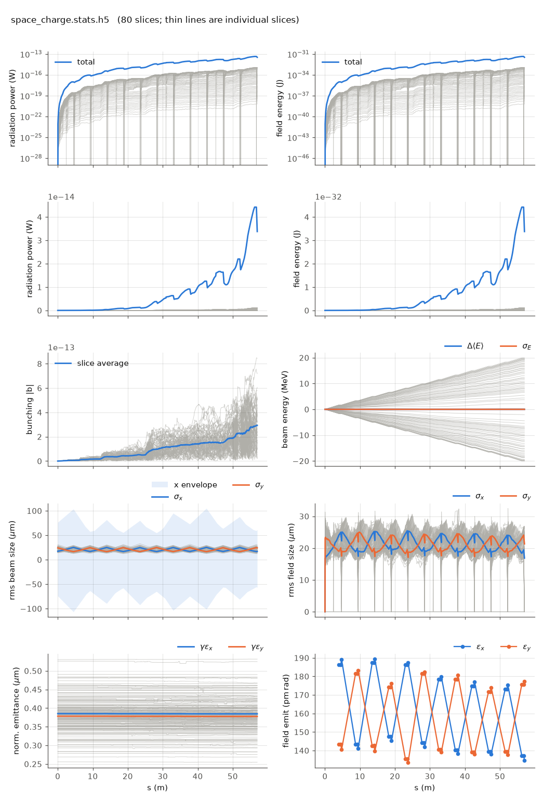

<!-- Generated by report_examples.py from examples/space_charge/. Do not edit. -->



Everything on this page lives in and runs from `lucifer/examples/space_charge/`.

Three commands, Bmad only:

    ../../../production/bin/lucifer lucifer.in
    ../../../production/bin/lucifer lucifer_off.in
    ../../../production/bin/lucifer lucifer_short_range.in
    ../../../production/bin/lucifer lucifer_gate_off.in
    python ../plot_fel.py space_charge.stats.h5

Space charge enters the pendulum equation as a per-particle `ez`, from per-slice
radial-harmonic solves plus a whole-window long-range term
(the manual's [space-charge section](../../fel-physics.md)). The two terms answer different
questions, so this example measures them separately.

Which elements it acts in is the elements' own business. `sc_line.bmad` calls the shared
lattice and sets Bmad's own attribute on the undulators, `wiggler::*[SPACE_CHARGE_METHOD]
= slice`, and the decks turn on Bmad's master switch,
`bmad_com%csr_and_space_charge_on`. The FEL slices are the bins the solve uses, so
`space_charge_com%n_bin` has nothing to say here and is ignored. `space_charge%` in the
deck holds the solver's numbers and nothing about whether it runs.

`lucifer.in` and `lucifer_off.in` isolate the long-range term on a cold dark beam: a
4 nm Gaussian bunch at 3 kA peak, no seed and no shot noise, so space charge is the
only channel that can change any particle's energy. The control run is the proof of
that: with space charge off, every slice's mean energy is unchanged to the last bit
over 57 m.

Measured on this input:

| | value |
|---|---|
| head-to-tail energy span after 57 m | 40.0 MeV, from -20.0 to +20.0 MeV per slice |
| the same relative to 5.8 GeV | 6.89e-3 |
| control run, space charge off | 0 eV, exactly |
| contribution of `nz = 2, nphi = 1` | 0 MeV |
| contribution of `longrange = T` | 40.0 MeV, all of it |

The beam-energy panel of the plot is the whole result: a symmetric fan opening from
zero to plus and minus 20 MeV, with the mean and the energy spread both flat on zero
through all 57 m. The bunch pushes itself apart, the tail losing energy and the head
gaining it, and the mean is preserved because the force is internal. The power panels
show numbers near 1e-13 W, which is the dark run's numerical floor rather than light. A 4 nm bunch is 13 attoseconds long,
which is where this matters. Lengthening it ten times at the same 3 kA peak, by scaling
`sig_z`, `bunch_charge` and `window_length` together, drops the span from 40.0 to
14.1 MeV. The effect weakens with bunch length and not in proportion to it, because a
4 nm bunch is far shorter than the beam's own 20 micrometer transverse size and the
simple line-charge scaling does not hold there.

The chirp is worth knowing at this size. At 6.89e-3 it is more than twenty times the
3.1e-4 bandwidth implied by the 2.25 m gain length of `../steady_state`, so a bunch
this short does not lase without something to compensate it.

The short-range harmonics measure exactly zero here, and that is correct rather than a
defect. They act on the density structure inside a slice, and a quiet-start dark beam
has none: the initial bunching is 4e-17. `lucifer_short_range.in` gives them something
to act on, by matching the `../steady_state` deck parameter for parameter and adding
`nz = 4, nphi = 1`. Against that run as its control:

| run | exit power | exit bunching |
|---|---|---|
| `../steady_state` (no space charge) | 761.5 MW | 0.1854 |
| `lucifer_short_range.in` | 767.2 MW | 0.1868 |

That is +0.75% in exit power, past saturation, from the short-range term acting on a
beam the FEL has bunched.

Two configurations refuse rather than surprise. `slice` with neither term configured,
`nz = 0` and `longrange = F`, is refused by name: the solve would cost its full price and
return an exact zero. And `fft_3d` on an FEL element is refused, since that solver wants a
three-dimensional grid this walk does not build.

The master switch off while the elements still ask for `slice` is not refused, because
that is how a lattice is run without space charge without editing it.
`lucifer_gate_off.in` is that case: the same lattice, the same solver numbers, the switch
false. The run says so by name and tracks the space-charge-free path, measured as exactly
the control run's zero.

Runs in ~7 s each.

## The input files

The deck, its variants, and any lattice they name, as they are on disk.

### `lucifer.in`

```fortran
&fel_params
  lat_file = "sc_line.bmad"
  global%out_root = "space_charge"

  bmad_com%csr_and_space_charge_on = T
  space_charge%rmax = 250e-6
  space_charge%nz = 2
  space_charge%nphi = 1
  space_charge%longrange = T
/

&fel_beam_init
  beam_init%n_particle = 512
  beam_init%bunch_charge = 1.003345e-13
  beam_init%sig_z = 4e-9
  beam_init%sig_pz = 0
  beam_init%a_norm_emit = 4e-7
  beam_init%b_norm_emit = 4e-7
/

&fel_wavefront_init
  wavefront_init%lambda0 = 1e-10
  wavefront_init%seed_power = 0
  wavefront_init%grid_n_pts = 129
  wavefront_init%grid_half_width = 2e-4
  wavefront_init%window_length = 2.4e-8
  wavefront_init%window_sample = 3
/
```

### `lucifer_gate_off.in`

```fortran
&fel_params
  lat_file = "sc_line.bmad"
  global%out_root = "gate_off"

  bmad_com%csr_and_space_charge_on = F
  space_charge%rmax = 250e-6
  space_charge%nz = 2
  space_charge%nphi = 1
  space_charge%longrange = T
/

&fel_beam_init
  beam_init%n_particle = 512
  beam_init%bunch_charge = 1.003345e-13
  beam_init%sig_z = 4e-9
  beam_init%sig_pz = 0
  beam_init%a_norm_emit = 4e-7
  beam_init%b_norm_emit = 4e-7
/

&fel_wavefront_init
  wavefront_init%lambda0 = 1e-10
  wavefront_init%seed_power = 0
  wavefront_init%grid_n_pts = 129
  wavefront_init%grid_half_width = 2e-4
  wavefront_init%window_length = 2.4e-8
  wavefront_init%window_sample = 3
/
```

### `lucifer_off.in`

```fortran
&fel_params
  lat_file = "../aramis.bmad"
  global%out_root = "sc_off"
/

&fel_beam_init
  beam_init%n_particle = 512
  beam_init%bunch_charge = 1.003345e-13
  beam_init%sig_z = 4e-9
  beam_init%sig_pz = 0
  beam_init%a_norm_emit = 4e-7
  beam_init%b_norm_emit = 4e-7
/

&fel_wavefront_init
  wavefront_init%lambda0 = 1e-10
  wavefront_init%seed_power = 0
  wavefront_init%grid_n_pts = 129
  wavefront_init%grid_half_width = 2e-4
  wavefront_init%window_length = 2.4e-8
  wavefront_init%window_sample = 3
/
```

### `lucifer_short_range.in`

```fortran
&fel_params
  lat_file = "sc_line.bmad"
  global%out_root = "short_range"
  bmad_com%csr_and_space_charge_on = T
  space_charge%rmax = 250e-6
  space_charge%nz = 4
  space_charge%nphi = 1
/

&fel_beam_init
  beam_init%n_particle = 8192
  beam_init%bunch_charge = 1.000692285594e-15
  beam_init%sig_z = 0
  beam_init%sig_pz = 8.804506566858e-5
  beam_init%a_norm_emit = 4e-7
  beam_init%b_norm_emit = 4e-7
/

&fel_wavefront_init
  wavefront_init%lambda0 = 1e-10
  wavefront_init%seed_power = 5e3
  wavefront_init%seed_waist_size = 30e-6
  wavefront_init%grid_n_pts = 255
  wavefront_init%grid_half_width = 2e-4
/
```

### `sc_line.bmad`

```fortran
! The benchmark line with space charge asked for on its undulators. The method is Bmad's
! own space_charge_method attribute, so the same lattice means the same thing in any Bmad
! program, and the FEL slices are the bins the solve uses.

call, file = ../aramis.bmad

wiggler::*[SPACE_CHARGE_METHOD] = slice
```
