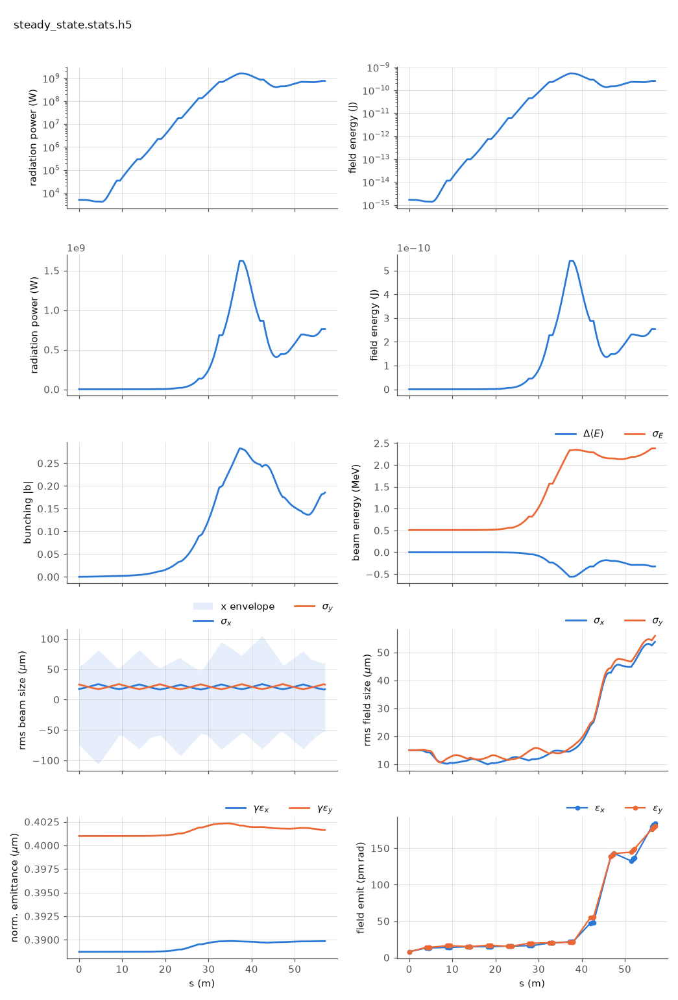

<!-- Generated by report_examples.py from examples/steady_state/. Do not edit. -->

# A seeded steady-state FEL: the first example to run



One command, Bmad only:

    ../../../production/bin/lucifer lucifer.in
    python ../plot_fel.py steady_state.stats.h5

A seeded, single-slice FEL on the benchmark line (`../aramis.bmad`): a 3 kA slice
and a 5 kW Gaussian seed at its waist, tracked through 6 FODO cells of helical
undulator. Nothing external is read. The program generates the quiet-start beam
and the seed field from the namelist, and the lattice supplies everything else.

`sig_z = 0` is what makes the run steady state: the whole charge sits in the one
slice window, so the current is `I = Q*c/slice_spacing` and `bunch_charge` above
encodes 3 kA exactly. The current is always derived this way, never entered
([the input reference](../../input-reference.md)).

Measured on this input: the quiet start is exact to an initial bunching of 4.0e-17,
so the FEL grows from the seed rather than from sampling noise. The power gain
length is 2.25 m, fitted to ln P over 4 to 30 m of lattice, which includes the
gainless breaks between segments. Saturation reaches 1.62 GW at z = 37.24 m, and
past saturation the power falls back to 761.5 MW at the exit as particles rotate in
the bucket. The beam sizes start on the lattice's matched values, since `init_beam_distribution`
generates the bunch from the Twiss in the lattice's `beginning` statement.

The two `dump_*_at` lines write the beam and the field at the third undulator,
`steady_state-at9-UND.beam.h5` and `-at9-UND.wf.h5`, both openPMD. `at9` is the
element index the locator resolved. Mid-run dumps are how a run is handed to
another program or restarted from the middle, and a single slice keeps them under
1.5 MB here. The same two lines on a 96-slice run write 111 MB.

Read [reading an output file](../../reading-output.md) for the stats file and the ten plot panels.
Runs in ~5 s.

## The input files

Every file below is read from `lucifer/examples/steady_state/`, which is where the commands above are run.

### `lucifer.in`

```fortran
&fel_params
  lat_file = "../aramis.bmad"
  global%out_root = "steady_state"
  global%dump_beam_at = "UND##3"
  global%dump_field_at = "UND##3"
/

&fel_beam_init
  beam_init%n_particle = 8192
  beam_init%bunch_charge = 1.000692285594e-15
  beam_init%sig_z = 0
  beam_init%sig_pz = 8.804506566858e-5
  beam_init%a_norm_emit = 4e-7
  beam_init%b_norm_emit = 4e-7
/

&fel_wavefront_init
  wavefront_init%lambda0 = 1e-10

  wavefront_init%seed_power = 5e3
  wavefront_init%seed_waist_size = 30e-6
  wavefront_init%grid_n_pts = 255
  wavefront_init%grid_half_width = 2e-4
/
```
