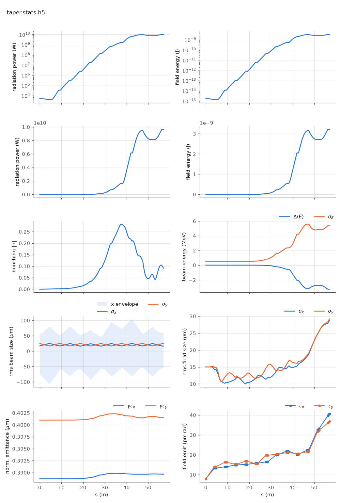

<!-- Generated by report_examples.py from examples/taper/. Do not edit. -->



Everything on this page lives in and runs from `lucifer/examples/taper/`.

One command, Bmad only:

    ../../../production/bin/lucifer lucifer.in
    python ../plot_fel.py taper.stats.h5

The `steady_state` run over `taper.bmad`, which is `../aramis.bmad` for the first
four FODO cells and then switches to a second undulator definition, `UND2`, whose
`b_max` and therefore `aw` is 0.4% lower. A step-down taper re-matches the
resonance to the beam the FEL has already decelerated, so the power keeps climbing
past the point where the untapered line saturates and turns over.

This is what driving the FEL from lattice attributes buys. A heterogeneous line is
a line of elements that differ, each carrying its own `b_max`, `l_period` and
`field_calc`, and the tracker derives each segment's `aw` from the element it is
standing in. There is no per-segment namelist input and nothing to keep in step
with the lattice.

Measured against `../steady_state` (same seed, same starting state):

| line | P at 57 m | behavior |
|---|---|---|
| `../aramis.bmad` (untapered) | 761.5 MW | saturates at 1.62 GW at z = 37.24 m, then falls back |
| `taper.bmad` (0.4% step at z = 38.0 m) | 9.64 GW | still climbing at the exit |

The step is at z = 38.0 m, where the fourth FODO cell ends. The two gain curves are
bit-identical until the first record inside the first `UND2`, at z = 38.045 m, which
is the check that the two runs differ in the taper and in nothing else. The exit
power is 12.66x the untapered exit and 5.95x the untapered saturation peak.

Runs in ~4 s.

## The input files

The deck, its variants, and any lattice they name, as they are on disk.

### `lucifer.in`

```fortran
&fel_params
  lat_file = "taper.bmad"
  global%out_root = "taper"
/

&fel_beam_init
  beam_init%n_particle = 8192
  beam_init%bunch_charge = 1.000692285594e-15
  beam_init%sig_z = 0
  beam_init%sig_pz = 8.804506566858e-5
  beam_init%a_norm_emit = 4e-7
  beam_init%b_norm_emit = 4e-7
/

&fel_wavefront_init
  wavefront_init%lambda0 = 1e-10

  wavefront_init%seed_power = 5e3
  wavefront_init%seed_waist_size = 30e-6
  wavefront_init%grid_n_pts = 255
  wavefront_init%grid_half_width = 2e-4
/
```

### `taper.bmad`

```fortran
! Two-stage tapered variant of ../aramis.bmad: the same 6-FODO-cell line, with the last
! two cells' undulators a second element definition whose b_max is stepped down 0.4%.
! What the taper does to the gain curve is this directory's README.

no_digested
parameter[geometry] = open
parameter[particle] = electron
parameter[e_tot] = 11357.82 * m_electron

beginning[beta_a] = 8.53711
beginning[alpha_a] = -0.703306
beginning[beta_b] = 17.3899
beginning[alpha_b] = 1.40348

! Stage 1: aw = 0.84853 rms helical, the Benchmark1-SASE undulator.
UND1: wiggler, l = 3.99, l_period = 0.015, field_calc = helical_model, &
      b_max = 0.84853 * (twopi / 0.015) * m_electron / c_light, &
      tracking_method = custom, ds_step = 0.045

! Stage 2: the same device with b_max, and so aw, 0.4% lower.
UND2: UND1, b_max = 0.99600 * 0.84853 * (twopi / 0.015) * m_electron / c_light

D1: drift, l = 0.44
D2: drift, l = 0.24
QF: quadrupole, l = 0.08, k1 = 2.0
QD: quadrupole, l = 0.08, k1 = -2.0

FODO1: line = (UND1, D1, QF, D2, UND1, D1, QD, D2)
FODO2: line = (UND2, D1, QF, D2, UND2, D1, QD, D2)
TAPERED: line = (4*FODO1, 2*FODO2)

use, TAPERED
```
