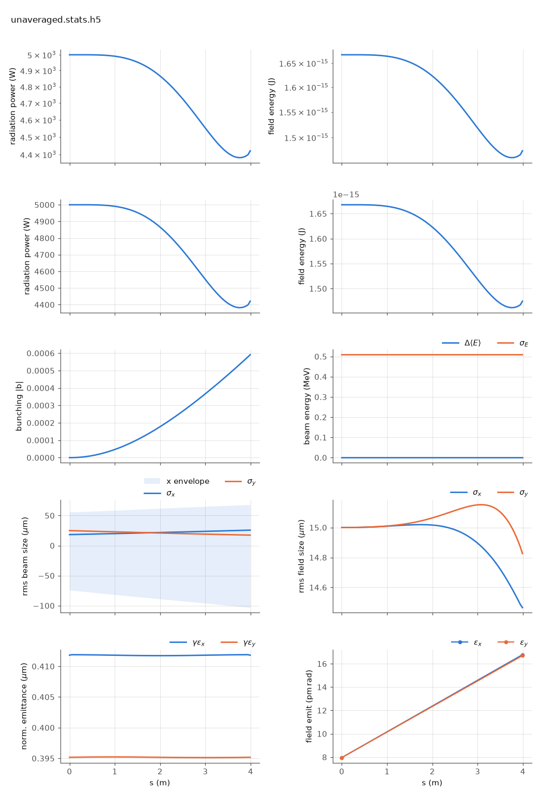

<!-- Generated by report_examples.py from examples/unaveraged/. Do not edit. -->

# The FEL with no period averaging



Two commands, Bmad only:

    ../../../production/bin/lucifer lucifer.in
    ../../../production/bin/lucifer lucifer_averaged.in
    python ../plot_fel.py unaveraged.stats.h5

One seeded steady-state segment tracked with no period averaging and no resonance
approximation (the manual's [unaveraged-mode section](../../fel-physics.md)). The particles ride the
real helical field, quiver and all, at 20 integration substeps per period with sin^2
entry and exit ramps, and the radiation is a co-evolving kick. Nothing in this path
knows the coupling factor `fc`: the energy exchange is what the Lorentz force does.

The mode is `seg1.bmad`'s own attribute, `fel_tracking = 1`, and the substep count and
ramp length are element attributes too, `fel_steps_per_period` and `fel_ramp_periods`.
`lucifer_averaged.in` runs the identical configuration through the averaged default by
calling the same lattice and overriding that one attribute.

Measured on this input: the two gain curves agree to 7.6e-4 in ln P at the segment
exit, 4.421 kW against 4.418 kW. That is two independent formulations of the same
physics, sharing no approximation, and the agreement is what pins the averaged mode's
coupling factor. The harness measures the factor itself to about 6e-4 with dedicated
probes ([validation](../../validation.md)).

The run also writes `unaveraged.ledger.txt`: beam energy relative to the reference and
window field energy per record, whose sum is conserved. The harness checks the closure
at 1e-4 of the turnover under a strong-exchange probe.

One segment sits in the lethargy regime, so the plot shows the two curves overlaid
rather than a gain curve. The seed diffracts and exponential growth is only beginning
at the exit. For the same comparison over a full line, with one segment unaveraged
among eleven averaged ones, see `../mixed_line`.

Runs in ~5 s, against under a second for the averaged twin.

## The input files

Every file below is read from `lucifer/examples/unaveraged/`, which is where the commands above are run.

### `lucifer.in`

```fortran
&fel_params
  lat_file = "seg1.bmad"
  global%out_root = "unaveraged"
  global%write_diag = T
/

&fel_beam_init
  beam_init%n_particle = 2048
  beam_init%bunch_charge = 1.000692285594e-15
  beam_init%sig_z = 0
  beam_init%sig_pz = 8.804506566858e-5
  beam_init%a_norm_emit = 4e-7
  beam_init%b_norm_emit = 4e-7
/

&fel_wavefront_init
  wavefront_init%lambda0 = 1e-10

  wavefront_init%seed_power = 5e3
  wavefront_init%seed_waist_size = 30e-6
  wavefront_init%grid_n_pts = 129
  wavefront_init%grid_half_width = 2e-4
/
```

### `lucifer_averaged.in`

```fortran
&fel_params
  lat_file = "seg1_averaged.bmad"
  global%out_root = "averaged"
  global%write_diag = T
/

&fel_beam_init
  beam_init%n_particle = 2048
  beam_init%bunch_charge = 1.000692285594e-15
  beam_init%sig_z = 0
  beam_init%sig_pz = 8.804506566858e-5
  beam_init%a_norm_emit = 4e-7
  beam_init%b_norm_emit = 4e-7
/

&fel_wavefront_init
  wavefront_init%lambda0 = 1e-10

  wavefront_init%seed_power = 5e3
  wavefront_init%seed_waist_size = 30e-6
  wavefront_init%grid_n_pts = 129
  wavefront_init%grid_half_width = 2e-4
/
```

### `seg1.bmad`

```fortran
! One undulator segment of the benchmark line, ../aramis.bmad's UND and nothing else:
! 3.99 m and 266 periods of helical undulator, aw = 0.85 rms, resonant at 1 Angstrom at
! 5.8 GeV. fel_tracking = 1 selects the unaveraged mode as this element's own attribute,
! and the averaged twin overrides it back to the default.

no_digested
parameter[geometry] = open
parameter[particle] = electron
parameter[e_tot] = 11357.82 * m_electron

beginning[beta_a] = 8.53711
beginning[alpha_a] = -0.703306
beginning[beta_b] = 17.3899
beginning[alpha_b] = 1.40348

fel_unaveraged = 1   ! Named value for the fel_tracking attribute.

UND: wiggler, l = 3.99, l_period = 0.015, field_calc = helical_model, &
     b_max = 0.84853 * (twopi / 0.015) * m_electron / c_light, &
     tracking_method = custom, ds_step = 0.045, fel_tracking = fel_unaveraged

SEG1: line = (UND)

use, SEG1
```

### `seg1_averaged.bmad`

```fortran
! The all-averaged twin of seg1.bmad: the element's fel_tracking overridden back to
! the default (0: averaged, the bmad_standard kernel's transverse maps).
call, file = seg1.bmad
fel_averaged = 0     ! Named value: the bmad_standard kernel default.
UND[FEL_TRACKING] = fel_averaged
```
