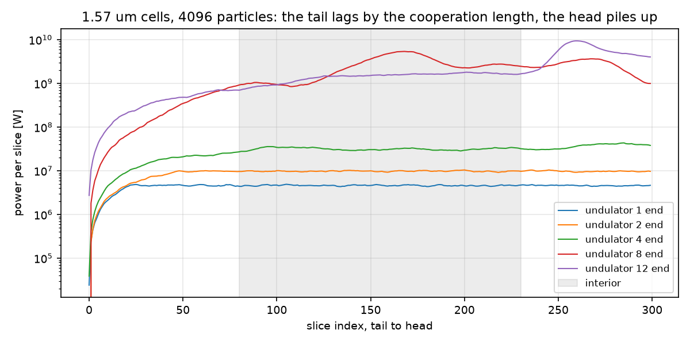
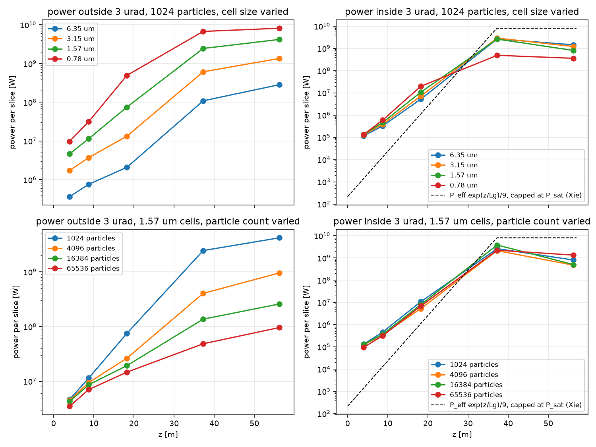
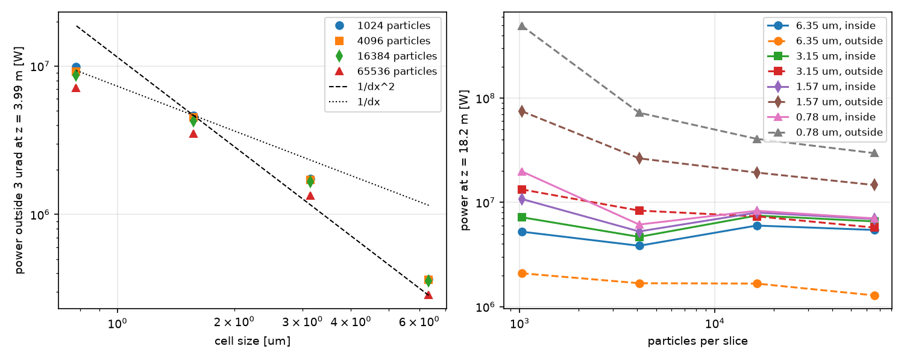
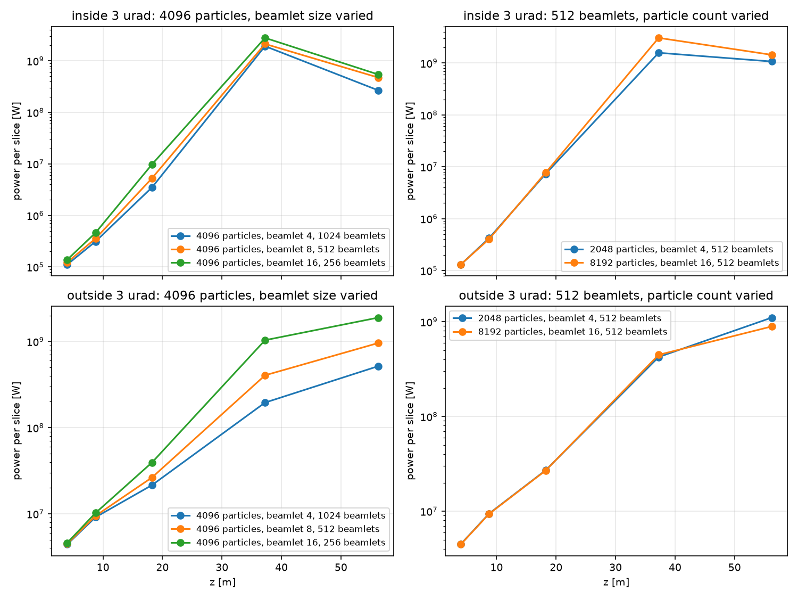
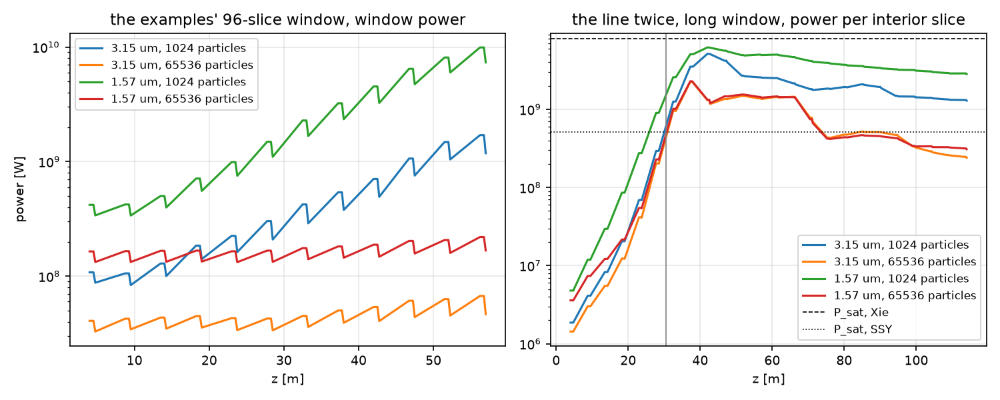

A run started dark reports a field power that depends on the transverse cell size and on the number of macroparticles per slice. On the migration example deck the exit power runs from 0.25 GW at 6.25 um cells to 37 GW at 0.78 um at 1024 particles per slice, and four times the particles cuts it by about six at either grid. Genesis4 does the same on the same decks, and Lucifer started from Genesis4's own dumps lands on it at 2e-6 at every grid, so the dependence belongs to the method the two codes share. This page measures where the power comes from, what converges and what does not, and how to choose the grid and the particle count for a SASE run.

Every number here is produced by `lucifer/tests/scripts/startup_noise.py`, which also draws the figures and writes `doc/generated/startup-noise/startup-noise.json`. It runs on demand and never in the benchmark harness:

```
python3 lucifer/tests/scripts/startup_noise.py --exe production/bin/lucifer --genesis <genesis4> \
        --pyrepo <openPMD-beamphysics> --examples lucifer/examples --latdir lucifer/tests \
        --workdir <dir> --out lucifer/doc/generated/startup-noise
```

## What the codes model

The quiet start loads each beamlet's bunching at the physical shot-noise level, harmonic by harmonic ([](fel-physics.md#sec-noise)). Every beamlet is one transverse point on the deposit grid. The paraxial field solver carries every transverse wavenumber up to the grid's Nyquist, and the source has no angular dependence, so a point beamlet radiates its noise at the resonant wavelength into every angle the grid holds. A real undulator emits at the resonant wavelength only inside the central cone, $\theta_{con} = \sqrt{1+K^2}/(\gamma\sqrt{N_w})$, 7 urad for one segment of this line, and emission at larger angles is red-shifted out of the FEL bandwidth. Neither code applies that cutoff. Spontaneous emission enters the field in no other way: `radiation_fluctuations` acts on the beam's energy and never on the field.

Once the beam bunches, each beamlet radiates coherently with its own bunching, into the same wide angles. A real beam of $N$ electrons in $N_b$ beamlets radiates coherently only inside the mode, and the wide-angle part of a bunched macroparticle beam scales as the beamlet charge squared times the beamlet count, which is $1/N_b$ of the coherent power. That part is an artifact of the load. The theory of SASE startup is reviewed in [](references.md): Ming Xie's fit for the gain length, and Saldin, Schneidmiller and Yurkov's effective shot-noise power and saturation estimates.

## The measurement

The deck is the examples' Aramis line, 3 kA, 5.8 GeV, 1 A, with a window of 300 slices at a spacing of twelve wavelengths, longer than the 320 nm the whole line slips, so the interior of the window is a long bunch. The tail sixty slices lag by the cooperation length and the head thirty collect the field that slips forward, so every power on this page is the mean over the interior slices 80 to 230, per slice.



The field is dumped at the ends of undulators 1, 2, 4, 8 and 12, at z of 4.0, 8.7, 18.2, 37.2 and 56.2 m. Each dump's far field is its FFT, and the power inside an angular radius of 3 urad is separated from the power outside it. The mode's diffraction angle $\lambda/(2\pi\sigma_x)$ is 0.74 urad, so the cut holds the mode with margin, and the split at saturation is the same for cuts of 2 and 5 urad. Early in the line the far field is flat in angle, so a cut of radius $\theta$ takes a share of the floor in proportion to $\theta^2$, and the coherent part is identifiable once it rises above that share, from about z = 10 m.

The runs are on the device at cells of 6.35, 3.15, 1.57 and 0.78 um (grids 64 to 512 over a half width of 2e-4 m) and at 1024, 4096, 16384 and 65536 particles per slice. One CPU run at 6.35 um and 1024 particles differs from the device run by 1.5e-3 on the interior power and 1.9e-3 on the power inside the cut, the device's usual band ([](validation.md#val-device)).

The theory for this deck, from the script: $\rho$ = 5.1e-4, $\sigma_x$ = 21 um, the 1D gain length 1.34 m, Ming Xie's 3D power gain length 1.79 m of undulator, the effective shot-noise power 1.9 kW per slice, $N_c$ = 1.5e6 electrons per coherence volume, a saturation length of 30.5 m and a saturated power of 0.5 GW by Saldin, Schneidmiller and Yurkov, and 8.1 GW by Ming Xie's estimate. The seeded steady-state example on the same line grows with an e-folding of 2.25 m along the line, which is 1.9 m of undulator once the drifts are counted, 6 percent from the fit.

## The floor



The power outside the cut at the end of the first segment does not move with the load and grows as the cells shrink, between $1/dx$ and $1/dx^2$:

| cell size | 1024 particles | 4096 | 16384 | 65536 |
|---|---|---|---|---|
| 6.35 um | 3.7e5 W | 3.6e5 | 3.6e5 | 2.9e5 |
| 3.15 um | 1.7e6 | 1.7e6 | 1.7e6 | 1.3e6 |
| 1.57 um | 4.7e6 | 4.5e6 | 4.3e6 | 3.5e6 |
| 0.78 um | 9.9e6 | 9.2e6 | 8.7e6 | 7.1e6 |

The power inside the cut at the same point is 0.9e5 to 1.3e5 W per slice for every grid and every load. The physical spontaneous power of the beam in the central cone of one segment, Saldin, Schneidmiller and Yurkov's eq. (1), is 0.71 MW, and the share of it inside 3 urad is 1.3e5 W. The loaded noise radiates the right power where the real beam radiates. What it adds is the emission outside the cone.



Past the first segments the outside power grows with the bunching, and now it depends on the load. At 1.57 um and z = 56 m it is 4.2e9, 9.6e8, 2.6e8 and 9.6e7 W per slice for 128, 512, 2048 and 8192 beamlets. The beamlet experiment separates the two counts:



| run | beamlets | outside 3 urad at z = 37 m | at z = 56 m |
|---|---|---|---|
| 4096 particles, beamlet size 4 | 1024 | 2.0e8 W | 5.2e8 |
| 4096 particles, beamlet size 8 | 512 | 4.1e8 | 9.6e8 |
| 4096 particles, beamlet size 16 | 256 | 1.0e9 | 1.9e9 |
| 2048 particles, beamlet size 4 | 512 | 4.2e8 | 1.1e9 |
| 8192 particles, beamlet size 16 | 512 | 4.5e8 | 8.9e8 |

The outside power is set by the beamlet count alone, inversely, and the particle count at a fixed beamlet count does not enter. That is the coherent emission of each beamlet with itself.

## The gain

The power inside the cut is the same curve for every grid and every load, within the SASE fluctuation of the interior mean, which is about 25 percent for the 150 slices and the 10-slice coherence length here. At z = 37.2 m it is 1.8e9 to 3.9e9 W per slice in fifteen of the sixteen runs, and the saturation point of the doubled line falls at 28 to 33 m for every run, beside the 30.5 m estimate. The saturated power sits between the two estimates, 0.5 and 8.1 GW. The interior bunching at 37 m is 0.20 to 0.30 in the same fifteen runs.

Two departures are measured. In the exponential regime the inside power rises with fewer beamlets, 3.5e6, 5.3e6 and 9.8e6 W at z = 18.2 m for 1024, 512 and 256 beamlets at 4096 particles, and 1.1e7 against 6.9e6 W at 1.57 um for 128 against 8192 beamlets. The beamlet's own field acts back on it, and the effect is a factor of about two in the exponential regime at the examples' load. The sixteenth run, 0.78 um cells with 1024 particles, is the one where the wide-angle emission reaches 6.8e9 W per slice at 37 m, above the coherent saturation. It drains the beam: the bunching there is 0.08 and the inside power 4.9e8 W, a fifth of the others.

## The line and the line twice



The examples run a window of 96 slices at three wavelengths, a 29 nm bunch, against a cooperation length $\lambda/(4\pi\rho)$ of 16 nm and 320 nm of slippage over the line. The field leaves such a bunch within a segment and a half, so its window power is the emission of the bunched beam into the field that passes, and most of that emission is the wide-angle part. The window power at the exit:

| window of 96 slices | 1024 particles | 65536 particles |
|---|---|---|
| 3.15 um cells | 1.18 GW | 0.047 GW |
| 1.57 um cells | 7.3 GW | 0.17 GW |

The two 65536 runs still differ by 3.6, the floor's own ratio between the two cell sizes, so the window power of this bunch is the wide-angle emission at every load measured. The examples' recorded powers, 3.0 GW for `examples/sase` at 255 points and 2048 particles and 3.13 GW for `examples/migration` at 151 points and 1024, are numbers of this kind. Their ratios, migration on against off, and wake on against off, are measured at one grid and one load and stand as ratios.

The long window through the line twice, 600 slices, gives the long-bunch answer. At 65536 particles the interior power at 3.15 and 1.57 um agrees: a peak of 2.24e9 and 2.28e9 W per slice at z = 37 m, and 2.4e8 and 3.1e8 W at 114 m as the saturated field decoheres. At 1024 particles the same runs saturate at the same z but hold 1.3e9 and 2.8e9 W at 114 m, which is the wide-angle emission piling up. Saturation forgives the startup and the saturation point, and it does not forgive the load in what the power diagnostic reports afterwards.

## Genesis4

On the harness's SASE tier deck, a 32-slice window of 9.6 nm at 2048 particles, Genesis4 4.6.15 with its FFT solver reports an exit window power of 2.26e7, 1.17e8 and 8.16e8 W at 151, 255 and 511 points, and with its ADI solver 2.26e7, 1.20e8 and 5.48e8 W. Lucifer started from Genesis4's dumps at each grid lands on its exit power at 1.9e-6, 1.9e-6 and 1.9e-6, with a worst record of 2.1e-6, the `tdsase` tier's level. The two codes discretize the transverse plane and the load identically, so the tiers cannot see the dependence, and that deck's bunch is 0.6 cooperation lengths long.

## Choosing the grid and the load

- Judge a dark start by the power inside the mode, or by the bunching, and never by the total field power alone. A field dump's far field splits the two, as the script does. A cheaper test is to double the particle count: a power that halves is wide-angle emission.
- For a long-bunch SASE result the window must be several cooperation lengths long, 16 nm here, and the slices within a few cooperation lengths of the tail are not representative. A window shorter than that is a short-bunch problem, and its power is dominated by the wide-angle emission at any load this page measured.
- Cells near 3 um resolve a 21 um beam. Finer cells raise the floor and buy nothing in the coherent power.
- The wide-angle emission at saturation scales as the bunching squared over the beamlet count, and between $1/dx$ and $1/dx^2$. On this line it falls under the coherent saturated power at 2048 beamlets for 1.57 um cells and at 512 beamlets for 3.15 um, which is 16384 and 4096 particles at a beamlet size of 8.
- The `check_sase_startup` check and the `tdsase` tier compare the two codes at one grid and one load. They hold the loading level and the transcription, and they say nothing about convergence in either.

The two ways to remove the artifact are measurements not yet made: a transverse deposit kernel wider than a cell, which would suppress the wavenumbers a point beamlet radiates into, and an angular filter on the source at the central cone. Either departs from Genesis4 on measurement.
