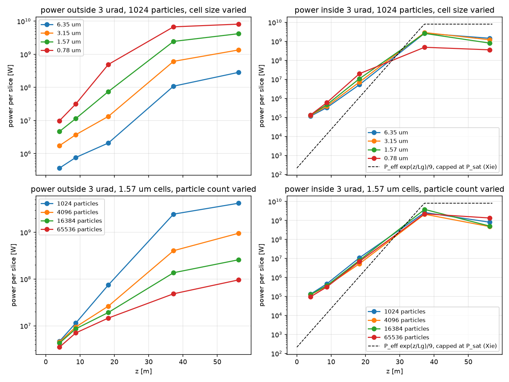
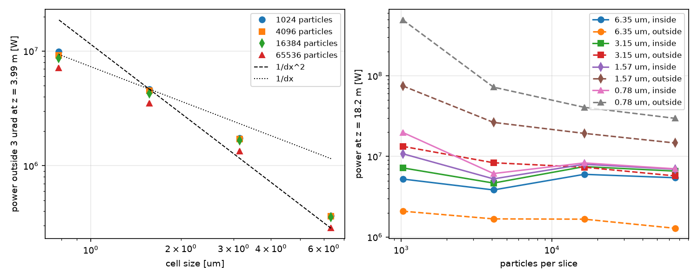

Self-amplified spontaneous emission (SASE) is simulated by starting the radiation field at zero and letting the shot noise of the electron beam seed the instability. This page calls such a run unseeded. The field power an unseeded run reports depends on the transverse cell size of the field grid and on the number of macroparticles per slice. On the input of the example in `examples/migration`, the exit power is 0.25 GW with 6.25 um cells and 37 GW with 0.78 um cells at 1024 macroparticles per slice, and four times the particles reduces it by about a factor of six at either cell size. Genesis4 shows the same dependence on the same inputs, and Lucifer started from Genesis4's own particle and field dumps reproduces it to 2e-6 at every grid, so the dependence belongs to the method the two codes share. This page identifies the source of the power, states what converges and what does not, and gives the grid, window and particle count a SASE run needs.

The analysis was carried out with `lucifer/tests/scripts/startup_noise.py`, which runs the simulations, draws the figures and writes every number quoted here to `doc/generated/startup-noise/startup-noise.json`. The script runs on demand and is not part of the benchmark harness:

```
python3 lucifer/tests/scripts/startup_noise.py --exe production/bin/lucifer --genesis <genesis4> \
        --pyrepo <openPMD-beamphysics> --examples lucifer/examples --latdir lucifer/tests \
        --workdir <dir> --out lucifer/doc/generated/startup-noise
```

## The model

The particle loader imposes shot noise on each beamlet's bunching at the physical level, harmonic by harmonic, following Fawley's algorithm ([](fel-physics.md#sec-noise)). Each beamlet occupies a single transverse point on the deposition grid. The paraxial field solver carries every transverse wavenumber up to the Nyquist wavenumber of the grid, and the source term has no angular dependence, so a point beamlet radiates its noise at the resonant wavelength into every angle the grid can represent. A real undulator emits at the resonant wavelength only within the central cone of half angle $\theta_{con} = \sqrt{1+K^2}/(\gamma\sqrt{N_w})$, which is 7 urad for one segment of the line studied here. Emission at larger angles is red-shifted out of the FEL bandwidth. Neither code applies that cutoff. Spontaneous emission enters the field in no other way. The switch `radiation_fluctuations` acts on the particle energies and never on the field.

Once the beam is bunched, each beamlet radiates coherently with its own bunching factor, again into every angle the grid can represent. A real beam of $N$ electrons radiates coherently only within the mode of the FEL. The wide-angle emission of a bunched beam of $N_b$ beamlets scales as the square of the beamlet charge times the beamlet count, which is $1/N_b$ of the coherent power. This part of the power is an artifact of the macroparticle representation. The theory used for comparison is Ming Xie's fitting formula for the gain length and the effective shot-noise power and saturation estimates of Saldin, Schneidmiller and Yurkov ([](references.md)).

## Method

The lattice is the Aramis line of the examples, with a peak current of 3 kA, an energy of 5.8 GeV and a radiation wavelength of 1 A. The time window holds 300 slices at a spacing of twelve wavelengths. It is longer than the 320 nm of slippage accumulated over the line, so the interior of the window behaves as a long bunch. The sixty slices nearest the tail lag by the cooperation length, and the thirty slices nearest the head collect the field that slips forward out of the interior. Every power quoted on this page is therefore the mean over slices 80 to 230 of the per-slice power.


The field is written to file at the ends of undulators 1, 2, 4, 8 and 12, at z of 4.0, 8.7, 18.2, 37.2 and 56.2 m. The far field of each record is its two-dimensional Fourier transform, and the power within an angular radius of 3 urad is separated from the power outside it. The diffraction angle of the mode, $\lambda/(2\pi\sigma_x)$, is 0.74 urad, so the cut contains the mode with margin. At saturation the split is the same for cuts of 2 and 5 urad. Early in the line the far field is flat in angle, so a cut of radius $\theta$ contains a share of the wide-angle emission proportional to $\theta^2$, and the coherent part becomes identifiable once it rises above that share, from about z = 10 m.

The runs use the Metal backend at cell sizes of 6.35, 3.15, 1.57 and 0.78 um, which are grids of 64, 128, 256 and 512 points over a half width of 2e-4 m, and at 1024, 4096, 16384 and 65536 macroparticles per slice. One CPU run at 6.35 um and 1024 particles differs from the corresponding device run by 1.5e-3 in the interior power and by 1.9e-3 in the power within the cut, which is the device's usual level ([](validation.md#val-device)).

The script computes the following quantities for this configuration. The Pierce parameter is $\rho$ = 5.1e-4 and the rms beam size $\sigma_x$ = 21 um. The one-dimensional gain length is 1.34 m and Ming Xie's three-dimensional power gain length is 1.79 m of undulator. The effective shot-noise power is 1.9 kW per slice, the number of electrons per coherence volume $N_c$ = 1.5e6, the saturation length 30.5 m, and the saturated power 0.5 GW by the estimate of Saldin, Schneidmiller and Yurkov and 8.1 GW by Ming Xie's. The seeded steady-state example on the same line has a power e-folding length of 2.25 m along the line, which is 1.9 m of undulator once the drift spaces are excluded, within 6 percent of the fit.

## Emission outside the mode



At the end of the first segment the power outside the cut is independent of the particle count and increases as the cells shrink, between $1/dx$ and $1/dx^2$:

| cell size | 1024 particles | 4096 | 16384 | 65536 |
|---|---|---|---|---|
| 6.35 um | 3.7e5 W | 3.6e5 | 3.6e5 | 2.9e5 |
| 3.15 um | 1.7e6 | 1.7e6 | 1.7e6 | 1.3e6 |
| 1.57 um | 4.7e6 | 4.5e6 | 4.3e6 | 3.5e6 |
| 0.78 um | 9.9e6 | 9.2e6 | 8.7e6 | 7.1e6 |

At the same point the power within the cut is 0.9e5 to 1.3e5 W per slice for every grid and every particle count. The spontaneous power of the beam within the central cone of one segment, eq. (1) of Saldin, Schneidmiller and Yurkov, is 0.71 MW, of which the share within 3 urad is 1.3e5 W. The loaded noise therefore radiates the physical power at the angles where a real beam radiates. What the model adds is the emission outside the cone.



Beyond the first segments the power outside the cut grows with the bunching, and it then depends on the particle count. At 1.57 um and z = 56 m it is 4.2e9, 9.6e8, 2.6e8 and 9.6e7 W per slice for 128, 512, 2048 and 8192 beamlets. Varying the beamlet size at a fixed particle count, and the particle count at a fixed beamlet count, separates the two:


| particles per slice, beamlet size | beamlets | outside 3 urad at z = 37 m | at z = 56 m |
|---|---|---|---|
| 4096, 4 | 1024 | 2.0e8 W | 5.2e8 |
| 4096, 8 | 512 | 4.1e8 | 9.6e8 |
| 4096, 16 | 256 | 1.0e9 | 1.9e9 |
| 2048, 4 | 512 | 4.2e8 | 1.1e9 |
| 8192, 16 | 512 | 4.5e8 | 8.9e8 |

The power outside the cut is inversely proportional to the beamlet count and independent of the particle count at a fixed beamlet count. This is the coherent emission of each beamlet with itself.

## Emission inside the mode

The power within the cut follows the same curve for every grid and every particle count, within the statistical fluctuation of the interior mean, which is about 25 percent for 150 slices and a coherence length of about 10 slices. At z = 37.2 m it is 1.8e9 to 3.9e9 W per slice in fifteen of the sixteen runs. The saturation point of the doubled line falls between 28 and 33 m for every run, against the estimate of 30.5 m. The saturated power lies between the two estimates of 0.5 and 8.1 GW. The interior bunching factor at 37 m is 0.20 to 0.30 in the same fifteen runs.

Two departures from convergence are measured. In the exponential regime the power within the cut rises as the beamlet count falls: 3.5e6, 5.3e6 and 9.8e6 W at z = 18.2 m for 1024, 512 and 256 beamlets at 4096 particles, and 1.1e7 against 6.9e6 W at 1.57 um for 128 against 8192 beamlets. The field of a beamlet acts back on the beamlet itself, and the effect is a factor of about two in the exponential regime at the particle count the examples use. The sixteenth run, with 0.78 um cells and 1024 particles, is the one in which the wide-angle emission reaches 6.8e9 W per slice at 37 m, above the coherent saturated power. That emission is drawn from the beam: the bunching factor there is 0.08 and the power within the cut 4.9e8 W, a fifth of the other runs.

## Short and long bunches


The SASE examples use a window of 96 slices at a spacing of three wavelengths, a bunch 29 nm long. The cooperation length $\lambda/(4\pi\rho)$ is 16 nm, and the slippage over the line is 320 nm. The field leaves such a bunch within a segment and a half, so the window power is the emission of the bunched beam into the field passing through it, and most of that emission is the wide-angle part. The window power at the exit of the line is:

| window of 96 slices | 1024 particles | 65536 particles |
|---|---|---|
| 3.15 um cells | 1.18 GW | 0.047 GW |
| 1.57 um cells | 7.3 GW | 0.17 GW |

The two runs with 65536 particles still differ by a factor of 3.6, which is the ratio of the wide-angle emission between the two cell sizes. The window power of this bunch is therefore the wide-angle emission at every particle count measured. The powers recorded in the example descriptions, 3.0 GW for `examples/sase` at 255 grid points and 2048 particles and 3.13 GW for `examples/migration` at 151 points and 1024 particles, are of this kind. The ratios those examples measure, migration enabled against disabled and wake enabled against disabled, are taken at one grid and one particle count and remain valid as ratios.

A window of 600 slices through a line of twice the length gives the long-bunch result. With 65536 particles the interior power at 3.15 and 1.57 um agrees: a peak of 2.24e9 and 2.28e9 W per slice at z = 37 m, falling to 2.4e8 and 3.1e8 W at 114 m as the saturated field loses coherence. With 1024 particles the same runs saturate at the same position but hold 1.3e9 and 2.8e9 W at 114 m, which is the accumulated wide-angle emission. Saturation is insensitive to the startup level and to the saturation position. It does not remove the particle-count dependence of the total power reported after saturation.

## Comparison with Genesis4

On the SASE input of the benchmark harness, a window of 32 slices spanning 9.6 nm with 2048 particles, Genesis4 4.6.15 reports an exit window power of 2.26e7, 1.17e8 and 8.16e8 W at 151, 255 and 511 grid points with its FFT solver, and 2.26e7, 1.20e8 and 5.48e8 W with its alternating-direction implicit solver. Lucifer started from Genesis4's dumps at each grid agrees with its exit power to 1.9e-6 at all three, with a worst relative difference over all records of 2.1e-6, which is the level of the `tdsase` tier. The two codes discretize the transverse plane and the particle distribution identically, so the comparison tiers cannot detect this dependence. That bunch is 0.6 cooperation lengths long.

## Recommendations

- Judge an unseeded run by the power within the mode or by the bunching factor, and not by the total field power alone. The far field of a field dump separates the two, as the script does. A simpler test is to double the particle count: a power that halves is wide-angle emission.
- A long-bunch SASE result requires a window several cooperation lengths long, 16 nm for this configuration, and the slices within a few cooperation lengths of the tail are not representative. A shorter window is a short-bunch problem, and its total power was dominated by wide-angle emission at every particle count measured here.
- Cells of about 3 um resolve a 21 um beam. Finer cells increase the wide-angle emission without changing the coherent power.
- The wide-angle emission at saturation scales as the square of the bunching factor divided by the beamlet count, and between $1/dx$ and $1/dx^2$ in the cell size. On this line it falls below the coherent saturated power at 2048 beamlets for 1.57 um cells and at 512 beamlets for 3.15 um cells, which is 16384 and 4096 particles per slice at a beamlet size of 8.
- The `check_sase_startup` check and the `tdsase` tier compare the two codes at one grid and one particle count. They verify the noise level and the transcription, and they say nothing about convergence in either quantity.

## Possible remedies

Two changes would remove the artifact and have not been measured: a transverse deposition kernel wider than one cell, which would suppress the wavenumbers a point beamlet radiates into, and an angular filter on the source term at the central cone. Either would be a departure from Genesis4 and would need its own measurement.
